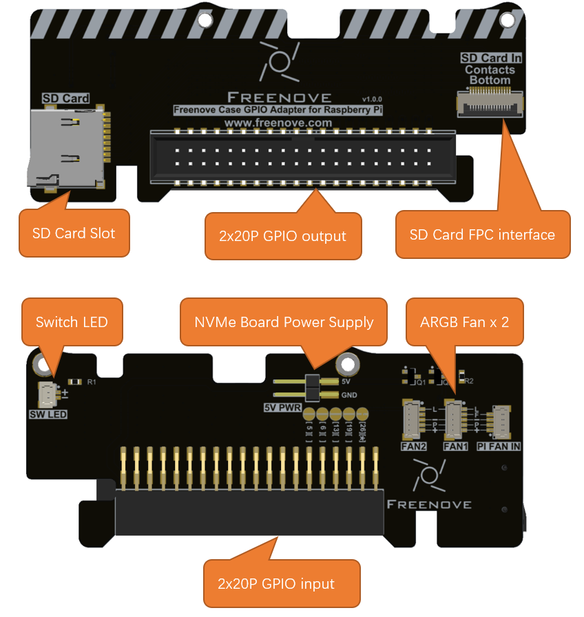
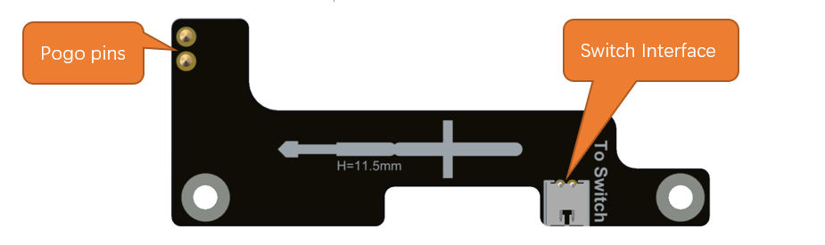
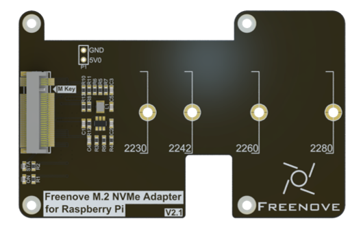
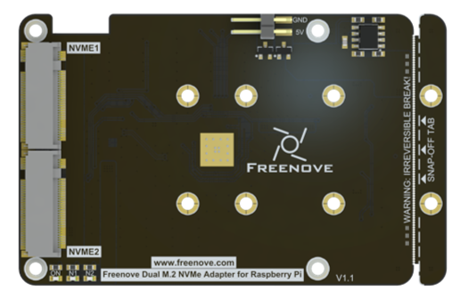
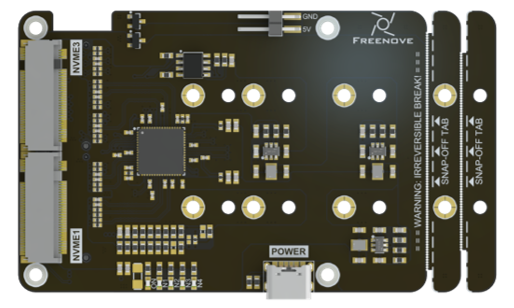
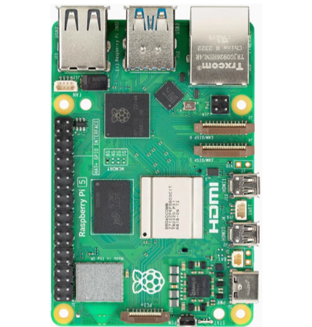
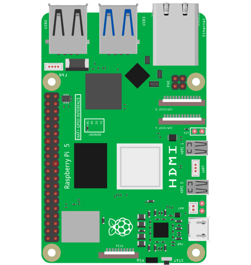
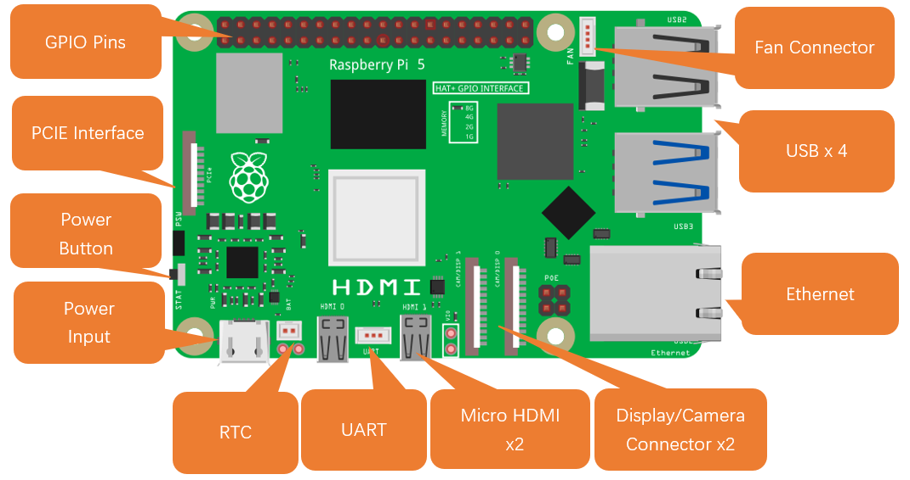
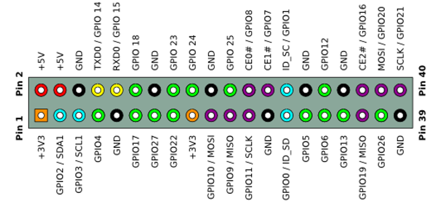

##############################################################################
Chapter 1 Introduction to Main Components
##############################################################################

In this chapter, we will mainly introduce the main components of this case and their functionalities.

1.1 Introduction to Freenove Case GPIO Adapter for Raspberry Pi
******************************************************************************

In this tutorial, we name this model as GPIO Board.

The GPIO Board serves to externally expose the Raspberry Pi 5's GPIO pins and SD card slot, allowing convenient connection of external peripherals and SD card access. 
Its integrated features also include:

* Two ARGB fan headers for independent control of the tower cooler fan and the case fan (Multiple RGB LED interface controls are available.).

* LED control for the case power switch, providing a clear visual indication of the Raspberry Pi 5’s power state (on/off).

* An auxiliary power connector for the NVMe Board.

1.2 Introduction to Freenove Power Button Board for Raspberry Pi
**************************************************************************

In this tutorial, we name this model as **Switch Board**.

The Switch Board connects to the J2 interface of the Raspberry Pi 5 via pogo pins, enabling the use of a custom power button. A 12mm power button with an indicator light is included, offering identical functionality to the onboard power button of the Raspberry Pi 5. For detailed specifications and usage of the power button, please refer to the Raspberry Pi official documentation: 

https://www.raspberrypi.com/documentation/computers/raspberry-pi.html#power-button

1.3 Introduction to Freenove M.2 NVMe Adapter Series for Raspberry Pi
**************************************************************************

The Raspberry Pi 5 includes a PCIe x1 slot that is certified for PCIe Gen 2.0, providing a theoretical maximum throughput of 5GT/sec, which roughly translates to 500MB/sec for read and write operations. Although this slot is not officially certified for PCIe Gen 3.0, it is possible to force the use of Gen 3.0 for potentially higher speeds.

The PCIe consortium states that the speed of PCIe Gen 3.0 x1 is up to 8GT/sec, which translates to approximately 985MB/sec.

https://en.wikipedia.org/wiki/PCI_Express#Comparison_table

https://www.raspberrypi.com/documentation/computers/raspberry-pi.html#pcie-gen-3-0

SSDs generally provide significantly faster read and write speeds compared to SD cards and USB drives, which can notably elevate the user experience when operating the Raspberry Pi 5.

1.3.1 Freenove M.2 NVMe Adapter for Raspberry Pi
========================================================

In this tutorial, we name this model as **NVMe Adapter Board**.

Here are its key features:

* **Interface Type**: M.2 with M-Key

* **Supported Protocol**: NVMe

* **PCIe Channel**: PCIe 3.0 x1(Compatible with PCIe 2.0)

* **Compatible Sizes**: 2230, 2242, 2260, 2280

* **Power Supply**: 3.3V, up to 3A (maximum)

* **Indicator Lights**: Includes both power and SSD status LEDs.

1.3.2 Freenove Dual M.2 NVMe Adapter for Raspberry Pi
=============================================================

This model has four NVMe SSD interface, supporting up to 2 NVMe SSDs to run simultaneously. In this tutorial, we name this model as **Dual-NVMe Adapter Board**.

Here are its key features:

* **Interface Type**: 2x M.2 with M-Key

* **Supported Protocol**: NVMe

* **PCIe Channel**: PCIe 2.0 x2

* **Compatible Sizes**: 2230, 2242, 2260, 2280

* **Power Supply**: 3.3V, up to 3A (maximum)

* **Indicator Lights**: Includes both power and x2 SSD status LEDs.

1.3.3 Freenove Quad M.2 NVMe Adapter for Raspberry Pi
=============================================================

This model has four NVMe SSD interface, supporting up to 4 NVMe SSDs to run simultaneously. In this tutorial, we name this model as **Quad-NVMe Adapter Board**.

Here are its key features:

* **Interface Type**: 4x M.2 with M-Key

* **Supported Protocol**: NVMe

* **PCIe Channel**: PCIe 2.0 x4

* **Compatible Sizes**: 2230, 2242, 2260, 2280

* **Power Supply**: 3.3V, up to 3A (maximum)

* **Indicator Lights**: Includes both power and x4 SSD status LEDs.

1.4 Introduction to Raspberry Pi 5 (RPi 5)
*****************************************************

At the time of this writing, this product only supports RPi5. The following shows the physical and model figures of an RPi 5.

.. table::
    :class: table-line
    :align: center
    
    +-----------------------------------------+----------------------------------+
    | Practicality picture of Raspberry Pi 5: | Model diagram of Raspberry Pi 5: |
    |                                         |                                  |
    | |Chapter01_05|                          | |Chapter01_06|                   |
    +-----------------------------------------+----------------------------------+

Hardware interface diagram of RPi 5 is shown below:

GPIO
==================================

GPIO: General purpose input/output. We will introduce the specific feature of the pins on the Raspberry Pi and how you can utilize them in all sorts of ways in your projects. Most RPi Module pins can be used as either an input or output, depending on your program and its functions. When programming the GPIO pins, there are three different ways to reference them: GPIO numbering, physical numbering, WiringPi GPIO Numbering.

BCM GPIO Numbering
==================================

The Raspberry Pi CPU uses Broadcom (BCM) processing chips BCM2835, BCM2836 or BCM2837. GPIO pin numbers are assigned by the processing chip manufacturer and are how the computer recognizes each pin. The pin numbers themselves do not make sense or have meaning, as they are only a form of identification. Since their numeric values and physical locations have no specific order, there is no way to remember them, so you will need to have a printed reference or a reference board that fits over the pins. 

Each pin is defined as below:

For more details about pin definition of GPIO, please refer to https://pinout.xyz/

Power requirements of various versions of Raspberry Pi are shown in following table:

.. table::
    :class: zebra
    :align: center
    
    +-------------------------+----------------------------------+----------------------------------------------------+-----------------------------------------------+
    | Product                 | Recommended PSU current capacity | Maximum total USB peripheral current draw          | Typical bare-board active current consumption |
    +=========================+==================================+====================================================+===============================================+
    | Raspberry Pi Model A    | 700mA                            | 500mA                                              | 200mA                                         |
    +-------------------------+----------------------------------+----------------------------------------------------+-----------------------------------------------+
    | Raspberry Pi Model B    | 1.2A                             | 500mA                                              | 500mA                                         |
    +-------------------------+----------------------------------+----------------------------------------------------+-----------------------------------------------+
    | Raspberry Pi Model A+   | 700mA                            | 500mA                                              | 180mA                                         |
    +-------------------------+----------------------------------+----------------------------------------------------+-----------------------------------------------+
    | Raspberry Pi Model B+   | 1.8A                             | 600mA/1.2A (switchable)                            | 330mA                                         |
    +-------------------------+----------------------------------+----------------------------------------------------+-----------------------------------------------+
    | Raspberry Pi 2 Model B  | 1.8A                             | 600mA/1.2A (switchable)                            | 350mA                                         |
    +-------------------------+----------------------------------+----------------------------------------------------+-----------------------------------------------+
    | Raspberry Pi 3 Model B  | 2.5A                             | 1.2A                                               | 400mA                                         |
    +-------------------------+----------------------------------+----------------------------------------------------+-----------------------------------------------+
    | Raspberry Pi 3 Model A+ | 2.5A                             | Limited by PSU, board, and connector ratings only. | 350mA                                         |
    +-------------------------+----------------------------------+----------------------------------------------------+-----------------------------------------------+
    | Raspberry Pi 3 Model B+ | 2.5A                             | 1.2A                                               | 500mA                                         |
    +-------------------------+----------------------------------+----------------------------------------------------+-----------------------------------------------+
    | Raspberry Pi 4 Model B  | 3.0A                             | 1.2A                                               | 600mA                                         |
    +-------------------------+----------------------------------+----------------------------------------------------+-----------------------------------------------+
    | Raspberry Pi 5 Model B  | 5.0A                             | 1.6A (600mA if using a 3A power supply)            | 800mA                                         |
    +-------------------------+----------------------------------+----------------------------------------------------+-----------------------------------------------+
    | Raspberry Pi Zero W     | 1.2A                             | Limited by PSU, board, and connector ratings only. | 150mA                                         |
    +-------------------------+----------------------------------+----------------------------------------------------+-----------------------------------------------+
    | Raspberry Pi Zero       | 1.2A                             | Limited by PSU, board, and connector ratings only  | 100mA                                         |
    +-------------------------+----------------------------------+----------------------------------------------------+-----------------------------------------------+

For more details, please refer to 

https://www.raspberrypi.com/documentation/computers/raspberry-pi.html#power-supply

:combo:`red font-bolder:In this product, the Raspberry Pi 5 is used and it must be powered by a 5.1V/5A power supply. Insufficient power may cause various functions to operate abnormally, or even permanently damage your Raspberry Pi 5. Therefore, we strongly recommend using a 5.1V/5A power supply to ensure optimal performance and avoid potential hardware failure.`