##############################################################################
Chapter 2 Case Assembly
##############################################################################

It is recommended to assemble and use the Freenove Computer Case Kit Mini for Raspberry Pi according to this tutorial. Otherwise, it may lead to incorrect device installation or damage. Please check all the parts again. Before getting started, please check the part list. If any component is missing from your kit, do not start assembly; instead, please email our support team at support@freenove.com to get the missing parts.

**Ensure the device is powered off before assembly.**

Use of the Screwdriver Bit Holder
**********************************************

.. table::
    :class: table-line
    :align: center
    
    +-----------------------------------------------------------------------------------------------+
    | When installing the brass standoff, simply place it directly into the bit holder.             |
    |                                                                                               |
    | |Chapter02_00|                                                                                |
    +-----------------------------------------------------------------------------------------------+
    | When installing the M3.7x10 Countersunk Head Screws, please use the PH2 hexagonal cross-bit.  |
    |                                                                                               |
    | |Chapter02_01|                                                                                |
    +-----------------------------------------------------------------------------------------------+
    | When installing other screws, please use the PH0 hexagonal cross-bit.                         |
    |                                                                                               |
    | |Chapter02_02|                                                                                |
    +-----------------------------------------------------------------------------------------------+

2.1 Raspberry Pi Assembly
*****************************************

2.1.1 Installing Standoffs
=======================================

.. table::
    :class: table-line
    :align: center
    
    +-----------------------------------------------------------------------------------------+
    | Step 1: Install M2.5*10+4 Brass Standoffs and M2.5*7 Brass Standoffs onto the RPi 5.    |
    |                                                                                         |
    | |Chapter02_03|                                                                          |
    +-----------------------------------------------------------------------------------------+
    | Step 2: Secure the M2.5*7 Brass Standoff onto the RPi 5 with M2.5x4x5 flat-head screws. |
    |                                                                                         |
    | |Chapter02_04|                                                                          |
    +-----------------------------------------------------------------------------------------+

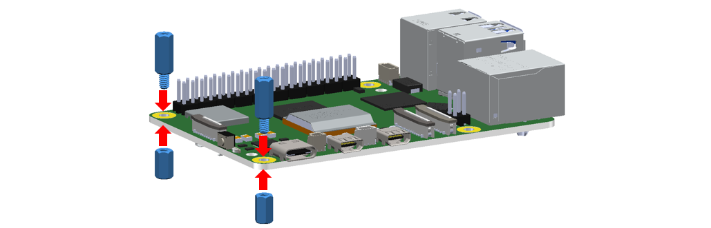
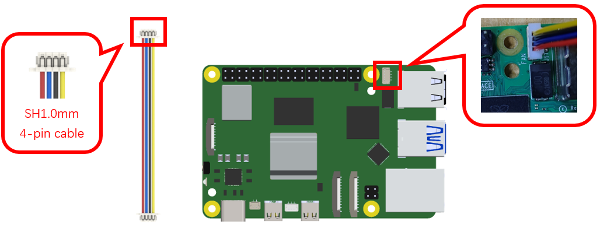

2.1.2 Connecting CAM/DIS Cable and Installing the Tower Cooler
=========================================================================

.. table::
    :class: table-line
    :align: center
    
    +---------------------------------------------------------------------------------------------------------------------------------------------------------------------------------------------------------------------------------------------------------------------------+
    | :red:`Note: The installation of a tower cooler may make it difficult to access the CAM/DISP interface. if you need to connect a device (such as a camera) to this interface, you must connect the cable before installing the cooler. Otherwise, you may skip this step.` |
    |                                                                                                                                                                                                                                                                           |
    | |Chapter02_05|                                                                                                                                                                                                                                                            |
    +---------------------------------------------------------------------------------------------------------------------------------------------------------------------------------------------------------------------------------------------------------------------------+
    | Step 1: Connect the 12cm SH1.0mm 4-pin cable to the FAN (J17) interface on the RPi 5. (:red:`This is a non-reversible connector. Improper handling or misalignment during connection will result in permanent damage to the interface.`)                                  |
    |                                                                                                                                                                                                                                                                           |
    | |Chapter02_06|                                                                                                                                                                                                                                                            |
    +---------------------------------------------------------------------------------------------------------------------------------------------------------------------------------------------------------------------------------------------------------------------------+
    | Step 2: Identify the five thermal pads by size and apply each one to its corresponding chip on the RPi 5. (:red:`Important: Ensure you remove the protective film from both sides of each pad to guarantee optimal thermal conductivity.`)                                |
    |                                                                                                                                                                                                                                                                           |
    | |Chapter02_07|                                                                                                                                                                                                                                                            |
    +---------------------------------------------------------------------------------------------------------------------------------------------------------------------------------------------------------------------------------------------------------------------------+
    | Steps 3: Fix the Tower Cooler to RPi 5 with the Nylon standoffs.                                                                                                                                                                                                          |
    |                                                                                                                                                                                                                                                                           |
    | |Chapter02_08|                                                                                                                                                                                                                                                            |
    +---------------------------------------------------------------------------------------------------------------------------------------------------------------------------------------------------------------------------------------------------------------------------+

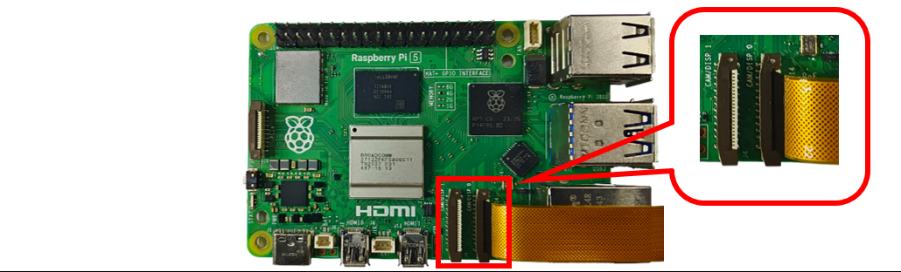
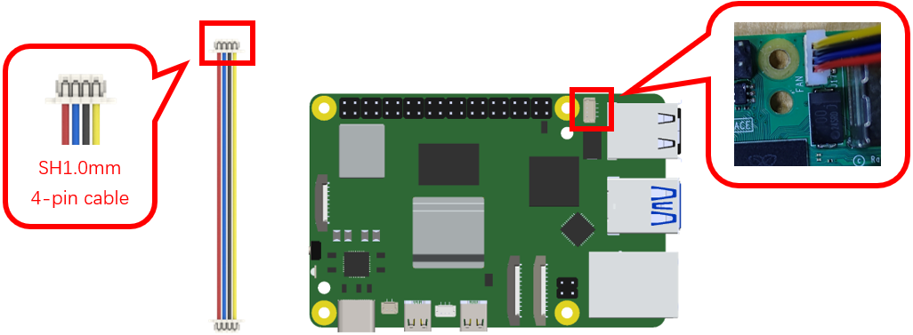
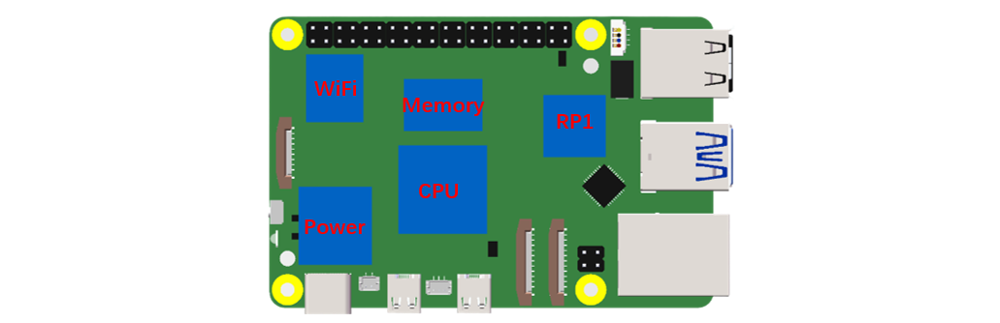
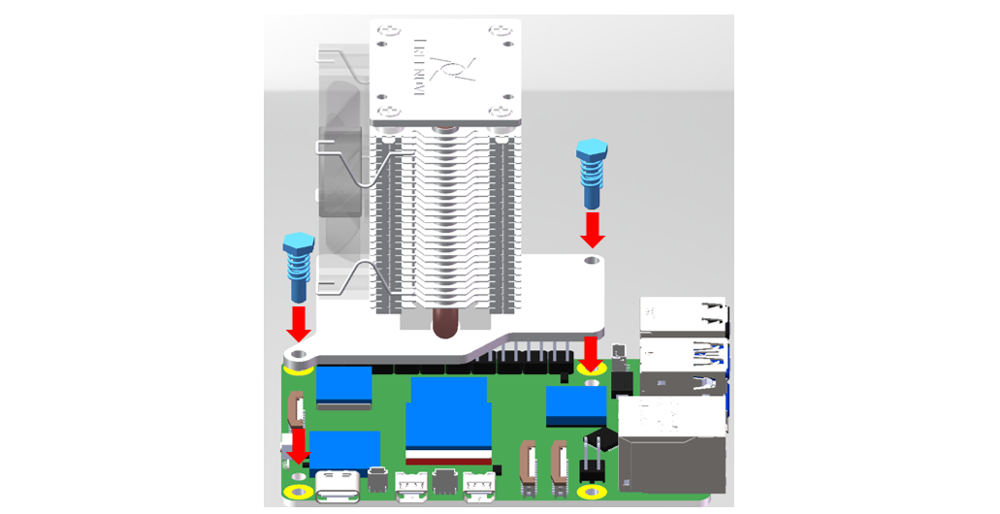

2.2 Mounting GPIO/Switch/NVMe/Power Board 
*******************************************************

2.2.1 Assembling GPIO Board and Switch Board
========================================================

.. table::
    :class: table-line
    :align: center
    
    +---------------------------------------------------------------------------------------------------------------------------------------------------------------------------------------------------------------------------------------------------------------------------------------------------------------+
    | Step 1: Before installing the GPIO Board, ensure that its connector is properly aligned with the Raspberry Pi 5's GPIO header. Once aligned, press it down evenly and firmly. (:red:`Note: Correct pin alignment is essential. Misalignment can cause a short circuit and damage the Raspberry Pi.`)          |
    |                                                                                                                                                                                                                                                                                                               |
    | |Chapter02_09|                                                                                                                                                                                                                                                                                                |
    +---------------------------------------------------------------------------------------------------------------------------------------------------------------------------------------------------------------------------------------------------------------------------------------------------------------+
    | Step 2: Align the pogo pins on the Switch Board with the two vias located between the Raspberry Pi's Type-C and HDMI0 ports. Once properly positioned, secure it using an M2.5x4x5 flat-head screw.                                                                                                           |
    |                                                                                                                                                                                                                                                                                                               |
    | |Chapter02_10|                                                                                                                                                                                                                                                                                                |
    +---------------------------------------------------------------------------------------------------------------------------------------------------------------------------------------------------------------------------------------------------------------------------------------------------------------+
    | Step 3: Connect SD Card to 0.5mm-16P FPC cable. Insert the "To Pi" end into the SD card slot on the RPi 5, and insert the "To Adapter" end into the "SD Card In" interface on the GPIO Board.                                                                                                                 |
    | (:red:`Gently flip-up the clip on the SD card interface to insert the cable.`)                                                                                                                                                                                                                                |
    |                                                                                                                                                                                                                                                                                                               |
    | |Chapter02_11|                                                                                                                                                                                                                                                                                                |
    +---------------------------------------------------------------------------------------------------------------------------------------------------------------------------------------------------------------------------------------------------------------------------------------------------------------+
    | Step 4: Connect the other end of the 12cm SH1.0mm 4-pin cable to the GPIO board's PI FAN IN connector. (:red:`This is a non-reversible connector. Improper handling or misalignment during connection will result in permanent damage to the interface.`)                                                     |
    |                                                                                                                                                                                                                                                                                                               |
    | |Chapter02_12|                                                                                                                                                                                                                                                                                                |
    +---------------------------------------------------------------------------------------------------------------------------------------------------------------------------------------------------------------------------------------------------------------------------------------------------------------+
    | Step 5: Connect the tower coller to the FAN1 header on the GPIO board. (:red:`Note: Speed feedback is only available when a fan is connected to the FAN1 header. This is a non-reversible connector. Improper handling or misalignment during connection will result in permanent damage to the interface.`)  |
    |                                                                                                                                                                                                                                                                                                               |
    | |Chapter02_13|                                                                                                                                                                                                                                                                                                |
    +---------------------------------------------------------------------------------------------------------------------------------------------------------------------------------------------------------------------------------------------------------------------------------------------------------------+

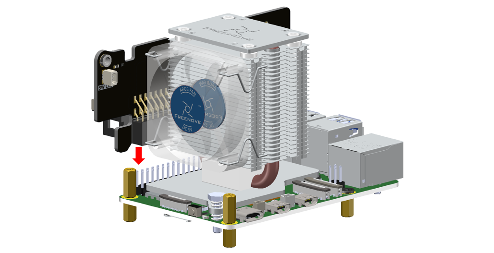
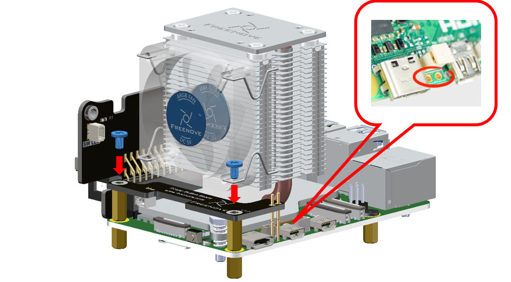
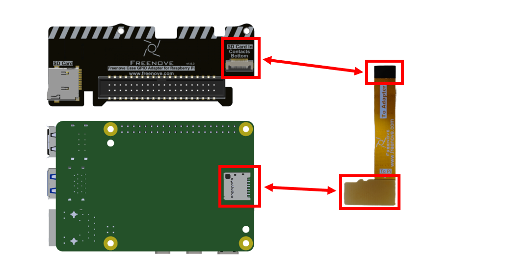
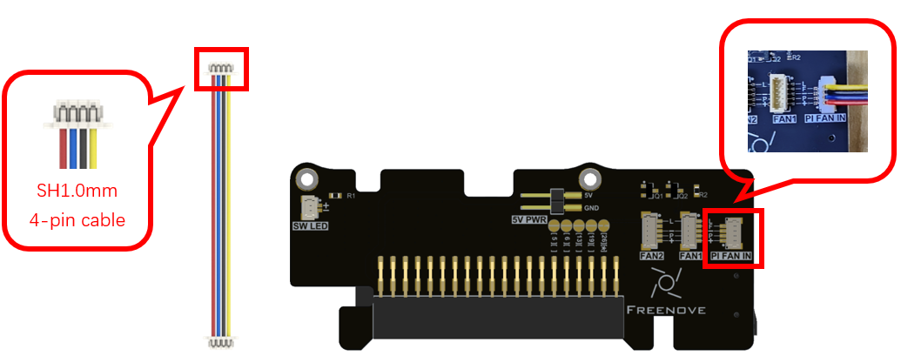
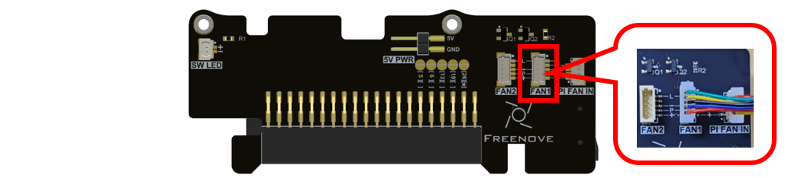

2.2.2 Assembling the NVMe Adapter Board
====================================================

Please select your product model below to view the corresponding installation instructions for the NVMe Adapter Board.

For **FNK0108A/H**: :ref:`NVMe Adapter Board <fnk0108/codes/base/2_case_assembly:installing nvme adapter board>`

For **FNK0108B/K**: :ref:`Dual-NVMe Adapter Board <fnk0108/codes/base/2_case_assembly:installing dual-nvme adapter board>`

For **FNK0108C/L**: :ref:`Quad-NVMe Adapter Board <fnk0108/codes/base/2_case_assembly:installing quad-nvme adapter board>`

Installing NVMe Adapter Board
----------------------------------------------------

.. table::
    :class: table-line
    :align: center
    
    +---------------------------------------------------------------------------------------------------------------------------------------------------------------------------------------------------------------------------------------------------------------------------------------------------+
    | Step 1: Based on the physical dimensions of your SSD, install the M2.5x3+3 brass standoff into the mounting hole corresponding to the 2230/2242/2260/2280 specification. Secure it from the reverse side using an M2.5 nut.                                                                       |
    |                                                                                                                                                                                                                                                                                                   |
    | |Chapter02_14|                                                                                                                                                                                                                                                                                    |
    +---------------------------------------------------------------------------------------------------------------------------------------------------------------------------------------------------------------------------------------------------------------------------------------------------+
    | Step 2: Tilt the SSD to insert it into the NVMe slot, and then secure it using an M2.5x2.5x5 flat-head screw.                                                                                                                                                                                     |
    |                                                                                                                                                                                                                                                                                                   |
    | |Chapter02_15|                                                                                                                                                                                                                                                                                    |
    +---------------------------------------------------------------------------------------------------------------------------------------------------------------------------------------------------------------------------------------------------------------------------------------------------+
    | Step 3: Align the NVMe Adapter Board with the mounting holes on the GPIO Board and secure it with M2.5x4x5 flat-head screws.                                                                                                                                                                      |
    |                                                                                                                                                                                                                                                                                                   |
    | |Chapter02_16|                                                                                                                                                                                                                                                                                    |
    +---------------------------------------------------------------------------------------------------------------------------------------------------------------------------------------------------------------------------------------------------------------------------------------------------+
    | Step 4: Connect the PCIe FPC cable. Connect the To Pi end to the RPi 5's PCIe interface, and the To Adapter end to the NVMe Adapter hat's FPC interface.(Caution: Gently pull the FPC latch to prevent damage that may cause FPC cable connection failure. Pay attention to the cable direction.) |
    |                                                                                                                                                                                                                                                                                                   |
    | |Chapter02_17|                                                                                                                                                                                                                                                                                    |
    +---------------------------------------------------------------------------------------------------------------------------------------------------------------------------------------------------------------------------------------------------------------------------------------------------+

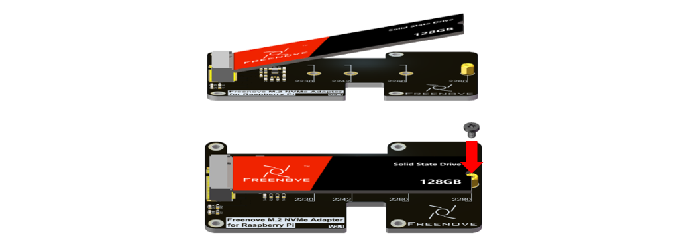
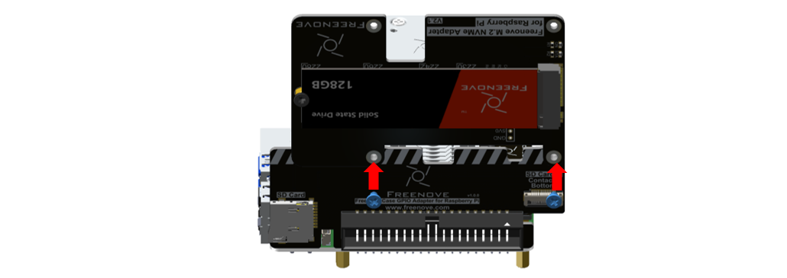
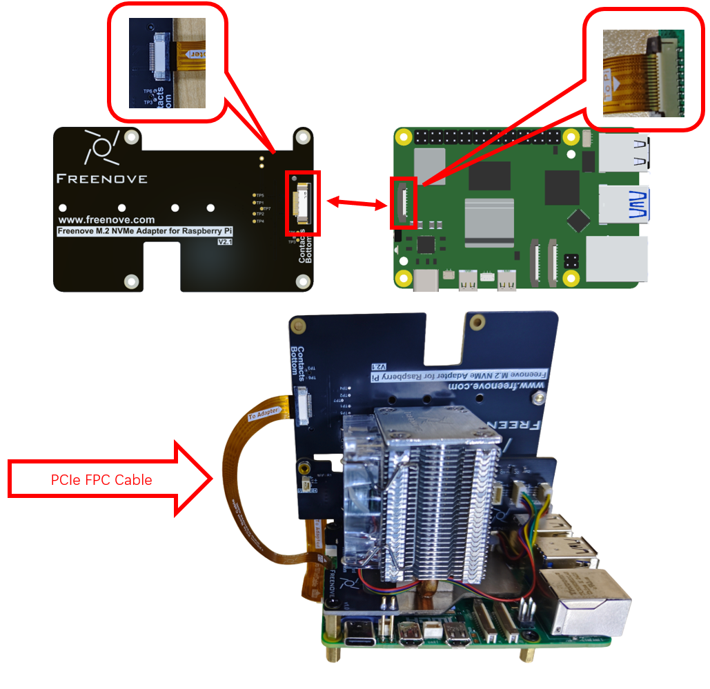

Installing Dual-NVMe Adapter Board
----------------------------------------------------

.. table::
    :class: table-line
    :align: center
    
    +-------------------------------------------------------------------------------------------------------------------------------------------------------------------------------------------------------------------------------------------------------------------------------------------------------------------------------------------------+
    | Step 1: Based on the physical dimensions of your SSD, install two M2.5x3+3 brass standoffs into the mounting hole corresponding to the 2230/2242/2260/2280 specification. Secure them from the reverse side with M2.5 nuts.                                                                                                                     |
    |                                                                                                                                                                                                                                                                                                                                                 |
    | |Chapter02_18|                                                                                                                                                                                                                                                                                                                                  |
    +-------------------------------------------------------------------------------------------------------------------------------------------------------------------------------------------------------------------------------------------------------------------------------------------------------------------------------------------------+
    | :red:`Note: This Adapter Board supports up to two SSDs. Install 0 to 2 SSDs based on your preference.`                                                                                                                                                                                                                                          |
    |                                                                                                                                                                                                                                                                                                                                                 |
    | Step 2: Tilt the SSDs to inster them into the two NVMe slots, and then secure them using M2.5x2.5x5 flat-head screws.                                                                                                                                                                                                                           |
    |                                                                                                                                                                                                                                                                                                                                                 |
    | |Chapter02_19|                                                                                                                                                                                                                                                                                                                                  |
    +-------------------------------------------------------------------------------------------------------------------------------------------------------------------------------------------------------------------------------------------------------------------------------------------------------------------------------------------------+
    | Step 3: Align the Dual-NVMe Adapter Board with the mounting holes on the GPIO Board and secure it with M2.5x4x5 flat-head screws.                                                                                                                                                                                                               |
    |                                                                                                                                                                                                                                                                                                                                                 |
    | |Chapter02_20|                                                                                                                                                                                                                                                                                                                                  |
    +-------------------------------------------------------------------------------------------------------------------------------------------------------------------------------------------------------------------------------------------------------------------------------------------------------------------------------------------------+
    | Step 4: Connect the PCIe FPC cable. Connect the **To Pi** end to the RPi 5's **PCIe interface**, and the **To Adapter** end to the NVMe Adapter hat's **FPC interface**. (:red:`Caution: Gently pull the FPC latch to prevent damage that may cause FPC cable connection failure. Pay attention to the cable direction.`)                       |
    |                                                                                                                                                                                                                                                                                                                                                 |
    | |Chapter02_21|                                                                                                                                                                                                                                                                                                                                  |
    |                                                                                                                                                                                                                                                                                                                                                 |
    | |Chapter02_22|                                                                                                                                                                                                                                                                                                                                  |
    +-------------------------------------------------------------------------------------------------------------------------------------------------------------------------------------------------------------------------------------------------------------------------------------------------------------------------------------------------+
    | Step 5: Connect two female-to-female jumper wires. Attach one end to the **pin headers** on the Dual-NVMe Adapter Board, and the other end to the **5V PWR** on the GPIO Board. (:red:`Caution: The red wire must connect to the 5V pin, and the black wire to the GND pin. Incorrect wiring may cause a short circuit and damage the device.`) |
    |                                                                                                                                                                                                                                                                                                                                                 |
    | |Chapter02_23|                                                                                                                                                                                                                                                                                                                                  |
    |                                                                                                                                                                                                                                                                                                                                                 |
    | **Generally, connecting the two jumper wires is not required. However, for SSDs with higher power consumption, it is necessary to connect them to ensure adequate power supply and stable operation.**                                                                                                                                          |
    +-------------------------------------------------------------------------------------------------------------------------------------------------------------------------------------------------------------------------------------------------------------------------------------------------------------------------------------------------+

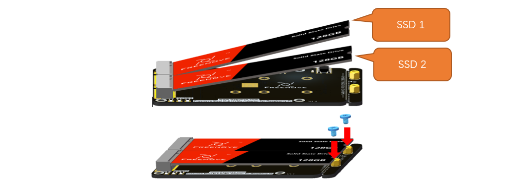
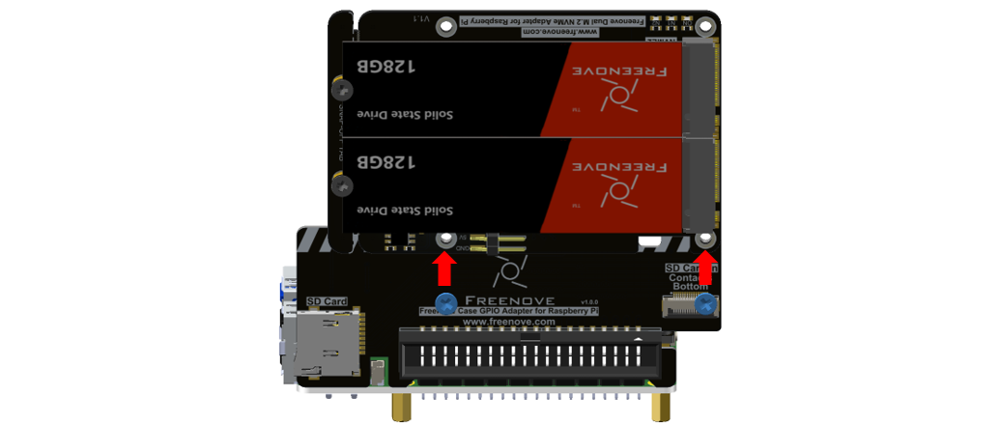
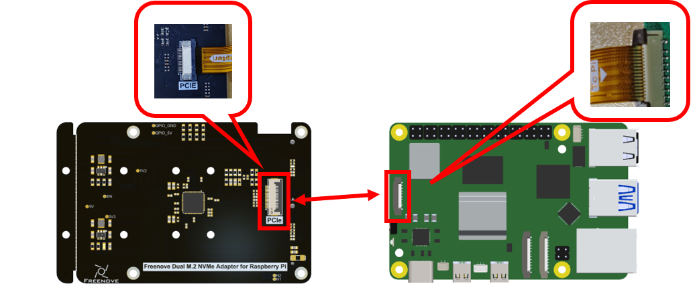
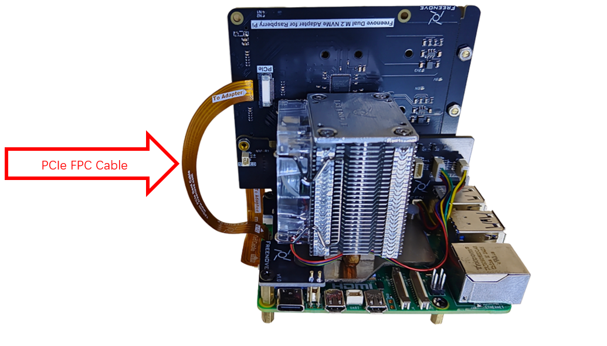
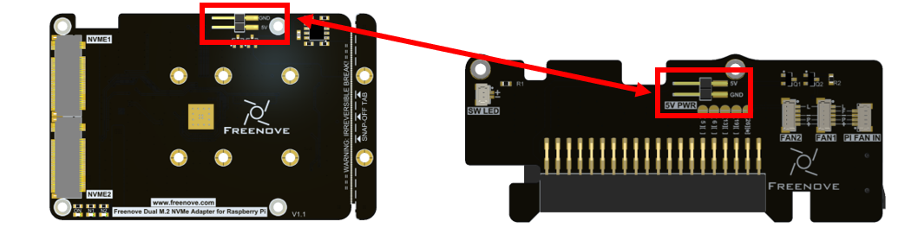

Installing Quad-NVMe Adapter Board
----------------------------------------------------

.. table::
    :class: table-line
    :align: center
    
    +-------------------------------------------------------------------------------------------------------------------------------------------------------------------------------------------------------------------------------------------------------------------------------------------------------------------------------------------------+
    | Step 1: Based on the physical dimensions of your SSD, install four M2.5x3+3 brass standoffs into the mounting hole corresponding to the 2230/2242/2260/2280 specification. Secure them from the reverse side with M2.5 nuts. It is recommended that you install standoffs to all the four mounting holes.                                       |
    |                                                                                                                                                                                                                                                                                                                                                 |
    | |Chapter02_24|                                                                                                                                                                                                                                                                                                                                  |
    +-------------------------------------------------------------------------------------------------------------------------------------------------------------------------------------------------------------------------------------------------------------------------------------------------------------------------------------------------+
    | :red:`Note: This Adapter Board supports up to four SSDs. Install 0 to 4 SSDs based on your preference.`                                                                                                                                                                                                                                         |
    |                                                                                                                                                                                                                                                                                                                                                 |
    | Step 2: Tilt the SSDs to inster them into the two NVMe slots on the front side, and then secure them using M2.5x2.5x5 flat-head screws.                                                                                                                                                                                                         |
    |                                                                                                                                                                                                                                                                                                                                                 |
    | |Chapter02_25|                                                                                                                                                                                                                                                                                                                                  |
    |                                                                                                                                                                                                                                                                                                                                                 |
    | Step 3: Tilt the SSDs to inster them into the two NVMe slots on the back side, and secure them using M2.5x2.5x5 flat-head screws.                                                                                                                                                                                                               |
    |                                                                                                                                                                                                                                                                                                                                                 |
    | |Chapter02_26|                                                                                                                                                                                                                                                                                                                                  |
    +-------------------------------------------------------------------------------------------------------------------------------------------------------------------------------------------------------------------------------------------------------------------------------------------------------------------------------------------------+
    | Step 4: Align the Quad-NVMe Adapter Board with the mounting holes on the GPIO Board and secure it with M2.5x4x5 flat-head screws.                                                                                                                                                                                                               |
    |                                                                                                                                                                                                                                                                                                                                                 |
    | |Chapter02_27|                                                                                                                                                                                                                                                                                                                                  |
    +-------------------------------------------------------------------------------------------------------------------------------------------------------------------------------------------------------------------------------------------------------------------------------------------------------------------------------------------------+
    | Step 5: Connect the PCIe FPC cable. Connect the **To Pi** end to the RPi 5's **PCIe interface**, and the **To Adapter** end to the NVMe Adapter hat’s **FPC interface**. (:red:`Caution: Gently pull the FPC latch to prevent damage that may cause FPC cable connection failure. Pay attention to the cable direction.`)                       |
    |                                                                                                                                                                                                                                                                                                                                                 |
    | |Chapter02_28|                                                                                                                                                                                                                                                                                                                                  |
    +-------------------------------------------------------------------------------------------------------------------------------------------------------------------------------------------------------------------------------------------------------------------------------------------------------------------------------------------------+
    | Step 6: Connect two female-to-female jumper wires. Attach one end to the **pin headers** on the Quad-NVMe Adapter Board, and the other end to the **5V PWR** on the GPIO Board. (:red:`Caution: The red wire must connect to the 5V pin, and the black wire to the GND pin. Incorrect wiring may cause a short circuit and damage the device.`) |
    |                                                                                                                                                                                                                                                                                                                                                 |
    | |Chapter02_29|                                                                                                                                                                                                                                                                                                                                  |
    |                                                                                                                                                                                                                                                                                                                                                 |
    | Generally, connecting the two jumper wires is not required. However, for SSDs with higher power consumption, it is necessary to connect them to ensure adequate power supply and stable operation.                                                                                                                                              |
    +-------------------------------------------------------------------------------------------------------------------------------------------------------------------------------------------------------------------------------------------------------------------------------------------------------------------------------------------------+

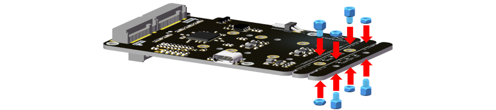
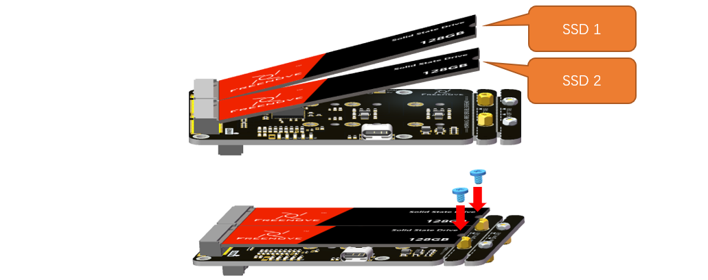
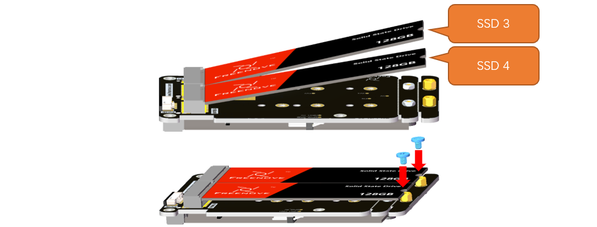
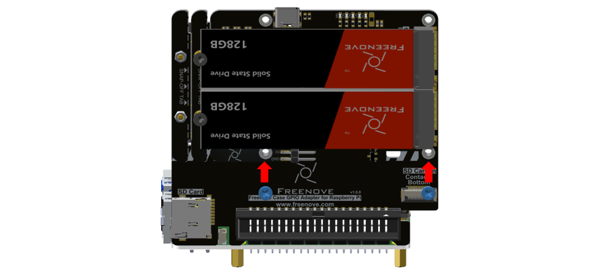
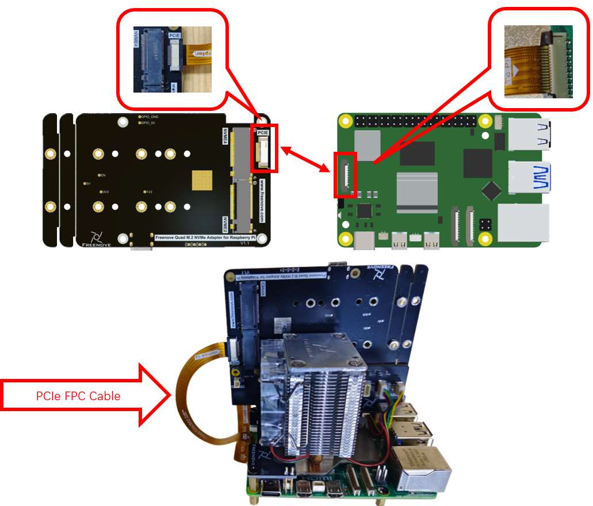
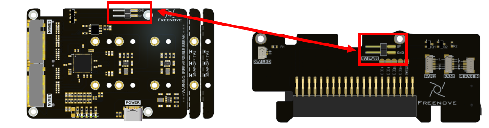

2.3 Case Assembly
*****************************

2.3.1 Assembling the Power Button and Connecting its cables
=====================================================================

.. table::
    :class: table-line
    :align: center
    
    +--------------------------------------------------------------------------------------------------------------------------------------------------------------------------------------------------------------------------------------------------------------------------------------------------+
    | Step 1: Insert the Black Sealing Gasket into the 12mm LED Power Button.                                                                                                                                                                                                                          |
    |                                                                                                                                                                                                                                                                                                  |
    | |Chapter02_30|                                                                                                                                                                                                                                                                                   |
    +--------------------------------------------------------------------------------------------------------------------------------------------------------------------------------------------------------------------------------------------------------------------------------------------------+
    | Step 2: Place the assembled 12mm LED Power Button into the circular slot on the top of the case. Secure it from the inside of the case using an M12 nut.                                                                                                                                         |
    |                                                                                                                                                                                                                                                                                                  |
    | |Chapter02_31|                                                                                                                                                                                                                                                                                   |
    +--------------------------------------------------------------------------------------------------------------------------------------------------------------------------------------------------------------------------------------------------------------------------------------------------+
    | Step 3: Connect the 7mm SH1.0mm to quick-disconnect terminal cable (red/black) and 7mm 1.25mm to 2.8mm quick-disconnect terminal cable (yellow-yellow) to the power headers. (:red:`Note: The red wire connects to the switch's '+' terminal, and the black wire connects to the '-' terminal.`) |
    |                                                                                                                                                                                                                                                                                                  |
    | |Chapter02_32|                                                                                                                                                                                                                                                                                   |
    +--------------------------------------------------------------------------------------------------------------------------------------------------------------------------------------------------------------------------------------------------------------------------------------------------+

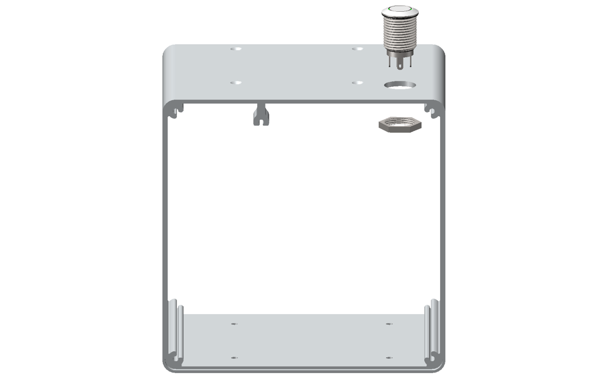
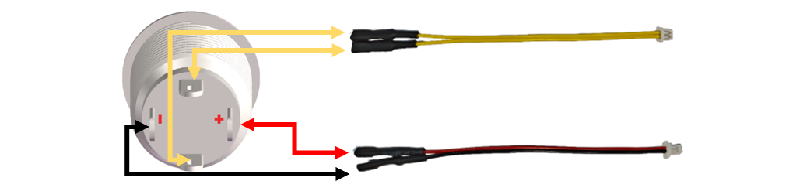

2.3.2 Installing Dust Filter, Fans, and Speakers
==============================================================

.. table::
    :class: table-line
    :align: center
    
    +---------------------------------------------------------------------------------------------------------------------------------------------------------------------------------------------------------------------------------------------------------------------------------+
    | Step 1: Peel off the protective film from the air inlet dust filter and affix it to the air inlet on the case.                                                                                                                                                                  |
    |                                                                                                                                                                                                                                                                                 |
    | |Chapter02_33|                                                                                                                                                                                                                                                                  |
    +---------------------------------------------------------------------------------------------------------------------------------------------------------------------------------------------------------------------------------------------------------------------------------+
    | Step 2:                                                                                                                                                                                                                                                                         |
    |                                                                                                                                                                                                                                                                                 |
    | :red:`Airflow Direction Description:`                                                                                                                                                                                                                                           |
    |                                                                                                                                                                                                                                                                                 |
    | :red:`The full fan blades are visible, is the air intake.`                                                                                                                                                                                                                      |
    |                                                                                                                                                                                                                                                                                 |
    | :red:`The side with the motor frame and protective grille is the air outlet.`                                                                                                                                                                                                   |
    |                                                                                                                                                                                                                                                                                 |
    | |Chapter02_34|                                                                                                                                                                                                                                                                  |
    |                                                                                                                                                                                                                                                                                 |
    | Place the dust filter between the fan and the case. Secure the fan using four M3.7x10 countersunk head screws from the outside of the case. (:red:`Note: During installation, ensure the fan's airflow direction is correct, The red arrow indicates the direction of airflow.`)|
    |                                                                                                                                                                                                                                                                                 |
    | |Chapter02_35|                                                                                                                                                                                                                                                                  |
    +---------------------------------------------------------------------------------------------------------------------------------------------------------------------------------------------------------------------------------------------------------------------------------+

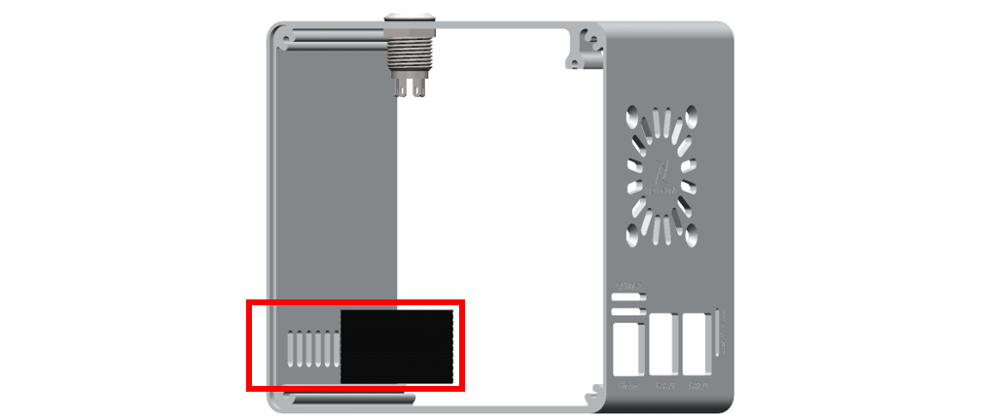

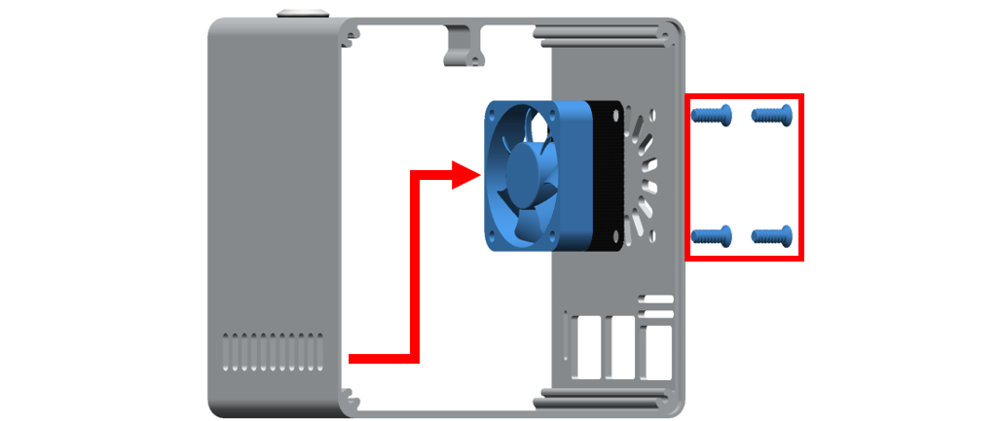

2.3.3 Placing the RPi into the Case
==========================================

.. table::
    :class: table-line
    :align: center
    
    +------------------------------------------------------------------------------------------------------------------------------------------------------------------------------------------------------------------------------------------------------------------------------------------+
    | Step 1: Connect the other end of the 7mm SH1.0mm to quick-disconnect terminal cable (red/black)into the **SW LED** header on the GPIO board. (This is a non-reversible connector. Improper handling or misalignment during connection will result in permanent damage to the interface.) |
    |                                                                                                                                                                                                                                                                                          |
    | |Chapter02_36|                                                                                                                                                                                                                                                                           |
    +------------------------------------------------------------------------------------------------------------------------------------------------------------------------------------------------------------------------------------------------------------------------------------------+
    | Step 2: Connect the other end of the 7mm 1.25mm to 2.8mm quick-disconnect terminal cable (yellow-yellow) into the Power Board. (:red:`This is a non-reversible connector. Improper handling or misalignment during connection will result in permanent damage to the interface.`)        |
    |                                                                                                                                                                                                                                                                                          |
    | |Chapter02_37|                                                                                                                                                                                                                                                                           |
    +------------------------------------------------------------------------------------------------------------------------------------------------------------------------------------------------------------------------------------------------------------------------------------------+
    | Step 3: Connect the case fan to the GPIO board's **FAN2** header. (:red:`This is a non-reversible connector. Improper handling or misalignment during connection will result in permanent damage to the interface.`)                                                                     |
    |                                                                                                                                                                                                                                                                                          |
    | |Chapter02_38|                                                                                                                                                                                                                                                                           |
    +------------------------------------------------------------------------------------------------------------------------------------------------------------------------------------------------------------------------------------------------------------------------------------------+
    | Step 4: Slide the Raspberry Pi into the case, align it with the pre-installed standoffs at the bottom, and secure it from the underside of the case with M2.5x4 countersunk head screws.                                                                                                 |
    |                                                                                                                                                                                                                                                                                          |
    | |Chapter02_39|                                                                                                                                                                                                                                                                           |
    +------------------------------------------------------------------------------------------------------------------------------------------------------------------------------------------------------------------------------------------------------------------------------------------+
    | Step 5: Secure the NVMe Adapter board with M2.5x4x5 flat-head screws.                                                                                                                                                                                                                    |
    |                                                                                                                                                                                                                                                                                          |
    | |Chapter02_40|                                                                                                                                                                                                                                                                           |
    +------------------------------------------------------------------------------------------------------------------------------------------------------------------------------------------------------------------------------------------------------------------------------------------+

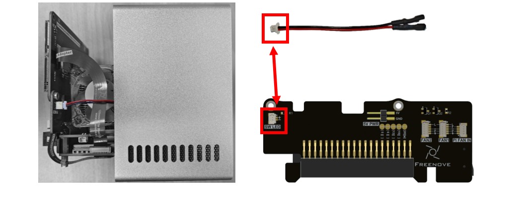
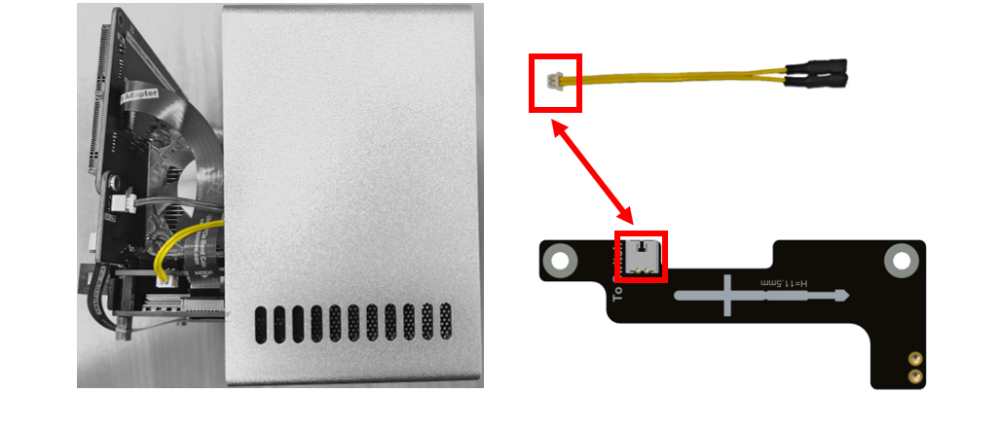
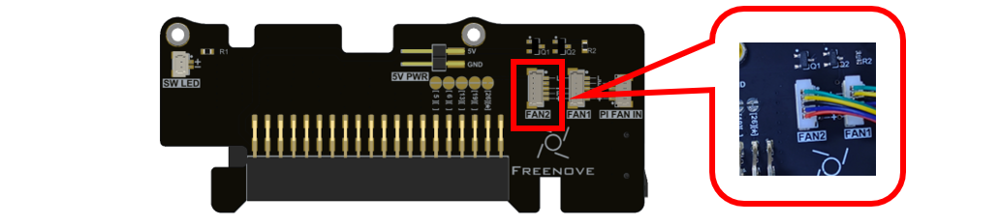
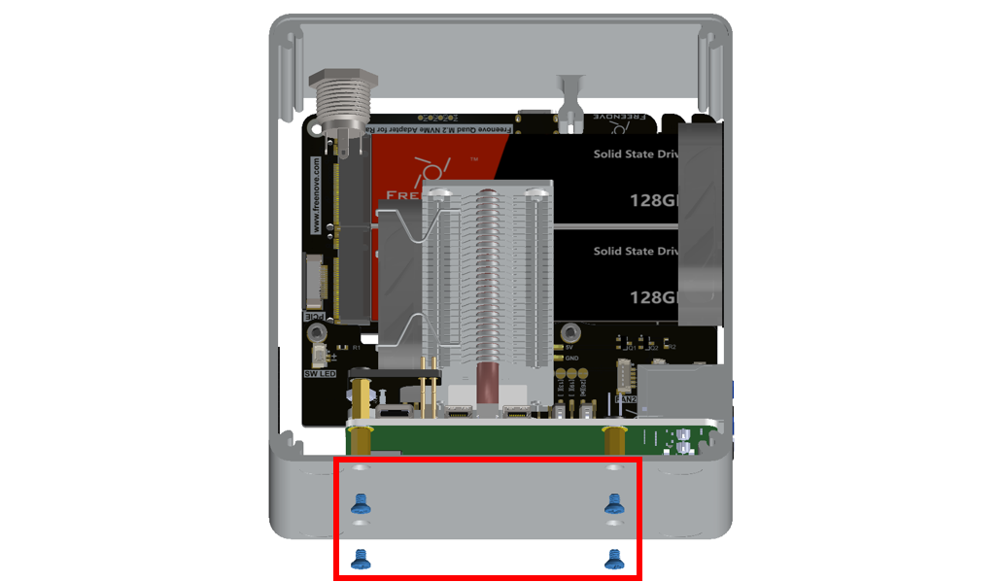
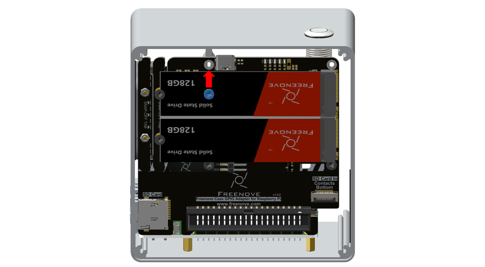

2.3.4 Installing Acrylic Plates and Foot Pads
===================================================

.. table::
    :class: table-line
    :align: center
    
    +-------------------------------------------------------------------------------------------------------------------------------------------------------------------------------------+
    | Step 1: Align the acrylic side plate (with the square cutout) with the GPIO headers, and secure it with M2.5x4x5 flat-head screws.                                                  |
    |                                                                                                                                                                                     |
    | |Chapter02_41|                                                                                                                                                                      |
    +-------------------------------------------------------------------------------------------------------------------------------------------------------------------------------------+
    | Step 2: Align the acrylic side panel (with Type-C and dual HDMI cutouts) with the Raspberry Pi 5's Type-C, HDMI0, and HDMI1 ports, and secure it using an M2.5x4x5 flat-head screw. |
    |                                                                                                                                                                                     |
    | |Chapter02_42|                                                                                                                                                                      |
    +-------------------------------------------------------------------------------------------------------------------------------------------------------------------------------------+
    | Step 3: Attach the round black non-slip foot pads to the four designated mounting points on the bottom of the case.                                                                 |
    |                                                                                                                                                                                     |
    | |Chapter02_43|                                                                                                                                                                      |
    +-------------------------------------------------------------------------------------------------------------------------------------------------------------------------------------+

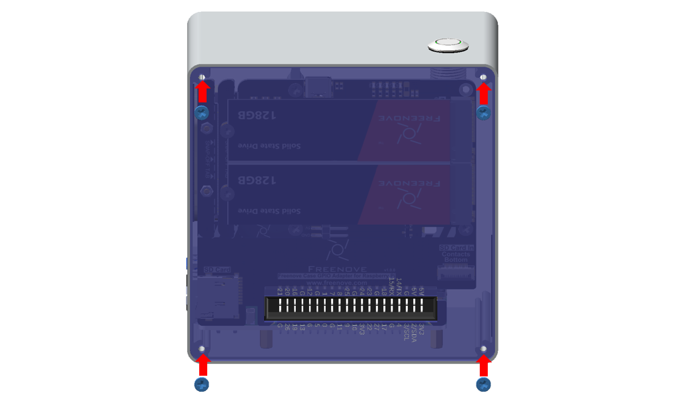
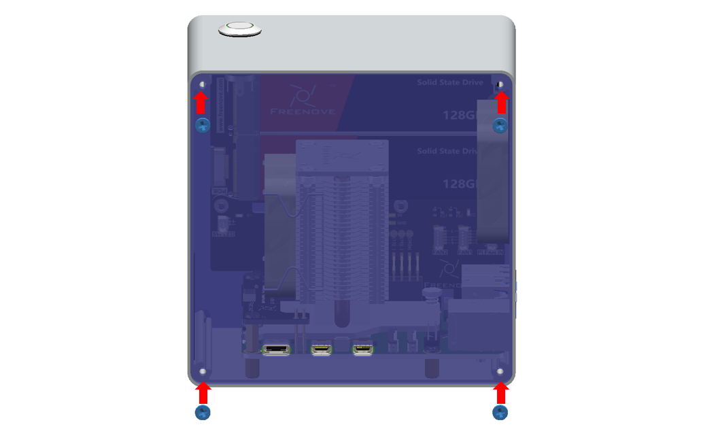
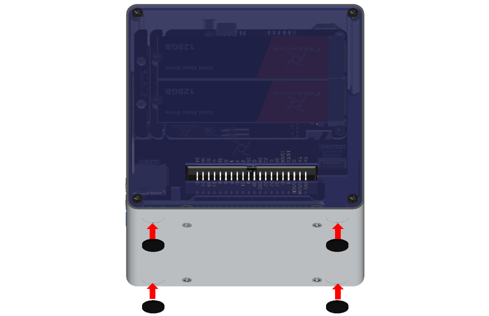