##############################################################################
Chapter 3 APP Control
##############################################################################

Before powering on the Freenove Computer Case Kit Mini for Raspberry Pi, please make sure that all cable connections are correct.

:red:`Due to its multiple functions, this case requires an adequate power supply. We highly recommend using the official Raspberry Pi 5.1V / 5A power adapter (https://www.raspberrypi.com/products/27w-power-supply ).`

:red:`Failure to do so may result in the Freenove Computer Case Kit Mini for Raspberry Pi being unusable or causing damage to components.`

How to Insert and Take out SD Card
****************************************************

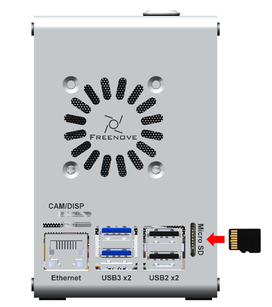

Remove the SD card with the written system from the card reader. 

Insert it into the self-ejecting TF card slot on the back of the case :red:`with the gold contacts facing up.`

Push the SD card in until you hear a click, indicating it is securely locked in place. 

To eject the SD card, press it in again until you hear a click, and the card will pop out.

Installing Raspberry Pi OS
************************************************

If you have not yet installed the Raspberry Pi OS, please refer to the documentation “:ref:`Installing Raspberry Pi OS <fnk0108/codes/install:installing raspberry pi os>`” under the directory Freenove Computer Case Kit Mini for Raspberry Pi to install the OS to your SD card or SSD.

**Important note** for users of the **FNK0108B/C/K/L** models: due to hardware limitations of the Dual-NVMe and Quad-NVMe Adapter Boards, please **do not** enable **PCIe 3.0** mode, as this may cause the Raspberry Pi to fail to boot.

If you have a display ready, please continue reading the tutorial below.

3.1 Boot Behavior & Environment Settings
************************************************

3.1.1 What to Expect on First Startup
=================================================

Upon finishing assembly, please follow the steps below to confirm that all functions are working properly.

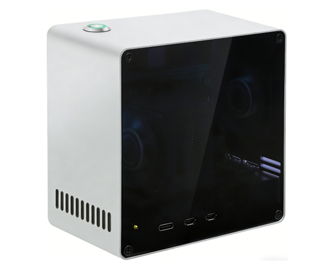

1.	When the Raspberry Pi starts, the fan should spin twice automatically, indicating normal operation. 

2.	During initial startup, the fan's LED won't light up; it will only illuminate after configuration and execution of the program.

**Troubleshooting Guide:**

If the fan does not spin upon Raspberry Pi boots up, please Immediately power off the system

* Verify proper alignment and connection between the GPIO adapter board and Raspberry Pi

* Check all relevant power and data connections

:red:`If you have any questions of the above, please contact us at support@freenove.com`

3.	RPi 5 Status LED: The green STAT LED will remain steadily illuminated. If this LED is not lit or displays any pattern other than a steady green light, it indicates that the Raspberry Pi operating system has not booted successfully. In this case, please check your Raspberry Pi hardware and OS installation separately.

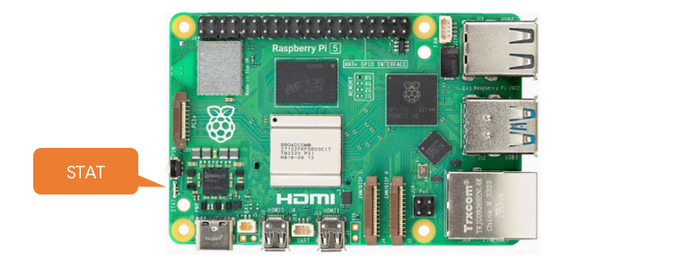

4.	NVMe Adapter Board Indicators:

ON LED: Steadily lit.

STA LED: Blinks in sync with the SSD's built-in activity light.

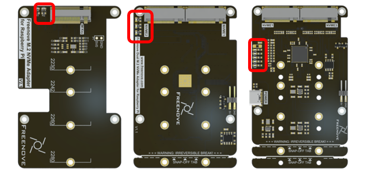

Should the ON indicator fail to illuminate, please check the cable connection.

Important: It is imperative to utilize the onboard pin header for supplemental power when operating multiple solid-state drives to mitigate risks associated with inadequate power supply.

If all components behaves as expected, then your computer case is correctly assembled and functioning well.

In this case, you can connect a screen to your Raspberry Pi or access it via VNC viewer. 

:red:`If you have any questions of the above, please contact us at support@freenove.com`

3.1.2 Software Setup
===============================================

Software Packages Update
----------------------------------

Run the following command on the terminal to update your Raspberry Pi's package list to the latest version.

.. code-block:: console
    
    sudo apt update

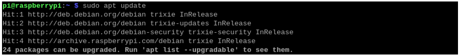

Code downloading
----------------------------------

Open the Raspberry Pi Terminal, type the following two commands one by one to download the code for the case.

.. code-block:: console
    
    cd
    git clone https://github.com/Freenove/Freenove_Computer_Case_Kit_Mini_for_Raspberry_Pi.git

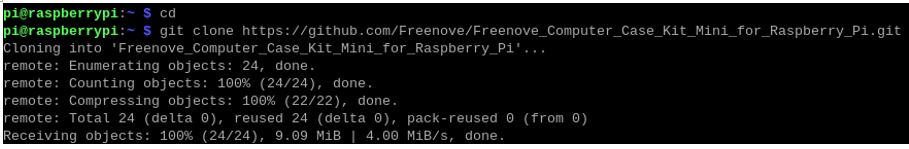

Creating Desktop Shortcut 
----------------------------------

Run the following two commands one by one in the Raspberry Pi terminal to create a desktop shortcut for the case control software. Configuring the software environment takes some time, please wait with patience.

.. code-block:: console
    
    cd Freenove_Computer_Case_Kit_Mini_for_Raspberry_Pi
    sudo python setup.py

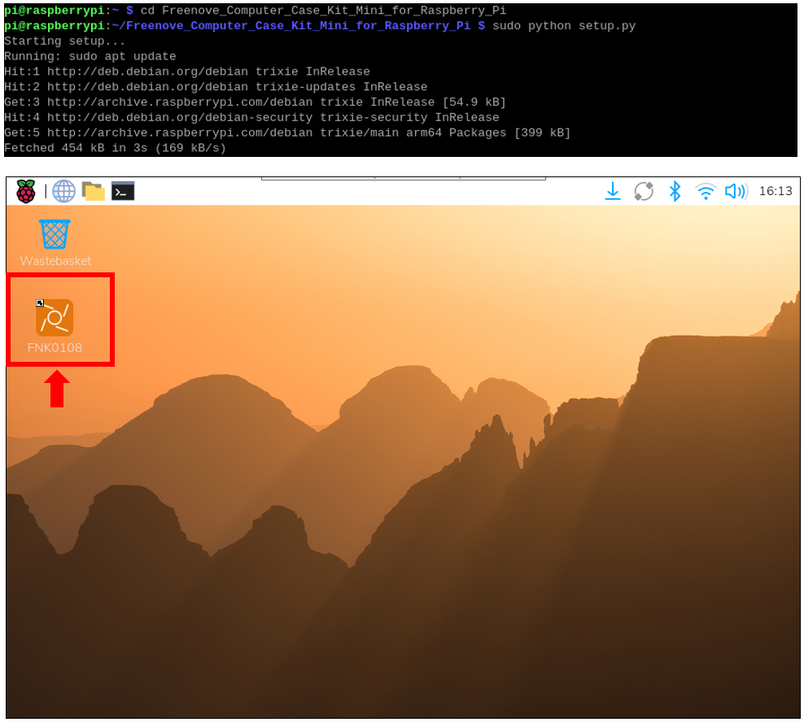

The icon above corresponds to the command shown below.

.. code-block:: console
    
    cd Freenove_Computer_Case_Kit_Mini_for_Raspberry_Pi
    python app_ui.py

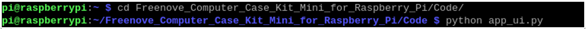

After completing this step, you will find the application in the **“Programming”** section of the menu.  If you accidentally delete the desktop shortcut or wish to add the app to the top launcher, simply right-click **“FNK0108”** and select **“Add to Desktop”** or **“Add to Launcher”**.

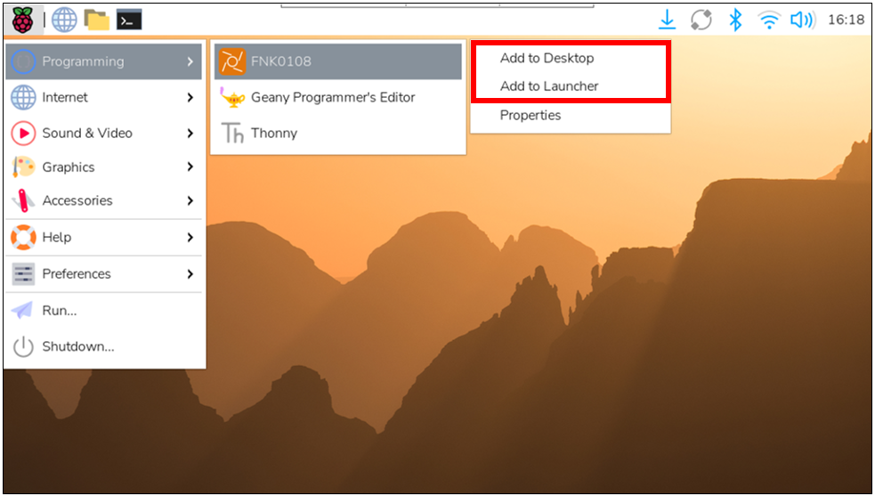

:red:`If you are interested in the code implementation, you can explore the files in the Freenove_Computer_Case_Kit_Mini_for_Raspberry_Pi/Code directory.`

:red:`Should you wish to modify the code, please ensure you back it up first to avoid potential software malfunctions caused by unintended changes.`

3.2 About the Case Control Software
************************************************

With the environment configured from the previous chapter, the accompanying host software can now be used to manage case functions including ARGB lighting and fan control. 

This chapter provides a detailed guide on the software's usage. For insight into the interface design, the app_ui.py file is available in the Freenove_Computer_Case_Kit_Mini_for_Raspberry_Pi/Code directory.

Double click the software with Freenove logo on RPi's desktop, and a window will pop up. Click “Execute” to run the program.

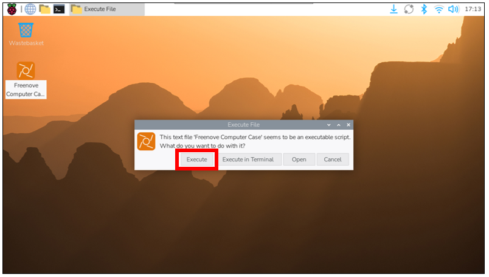

The software interface is as shown below.

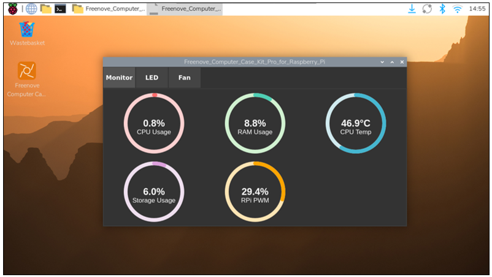

3.2.1 Dashboard Monitoring
===============================================

The dashboard provides live monitoring of key RPi 5 and case component stats, giving you an at-a-glance view of the system status.

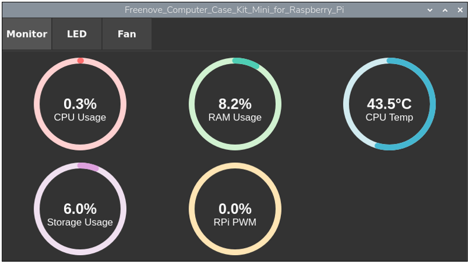

Below is a detailed explanation of the parameters displayed on the monitoring interface:

* CPU Usage: Current processor utilization percentage of the Raspberry Pi 5

* RAM Usage: Current system memory utilization percentage of the Raspberry Pi 5

* CPU TEMP: The internal temperature of the Raspberry Pi 5's SoC (System on Chip)

* Storage Usage: The total storage space utilization. This value reflects the usage of the SD card if one is used. If single or multiple SSDs are installed, it calculates the aggregate usage across all drives.

* RPi PWM: PWM duty cycle for the Raspberry Pi's active cooler fan

**Data Source & Troubleshooting:**

**CPU Usage, RAM Usage, CPU Temp, Storage Usage, and RPi PWM are retrieved directly from the Raspberry Pi. If any of these values are missing, check the Raspberry Pi for faults.**

If these data cannot be obtained consistently, please contact us by email: support@freenove.com

:red:`For those interested in the interface implementation, please refer to the files api_systemInfo.py in the Freenove_Computer_Case_Kit_Mini_for_Raspberry_Pi/Code directory.`

3.2.2 LED Control Interface
===========================================

This is the control interface for the case ARGB lights. You can select different modes to display various lighting effects.

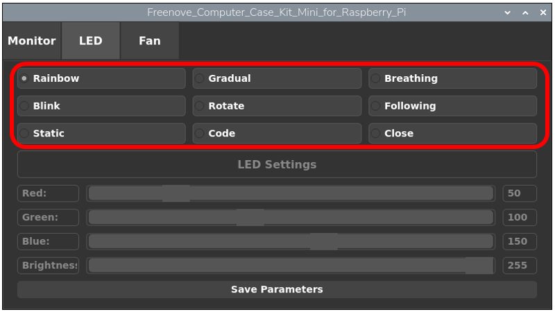

There are various preset lighting effect available, namely **Rainbow, Gradual, Breathing, Blink, Rotate, Following, Static and Code**. You can select the corresponding option to switch among the modes.

Note: Only in **Breathing, Blink, Rotate, Following, Static** modes can the color and brightness of the RGB lights be controlled using the slider below. In other modes, the color and brightness of the RGB lights cannot be adjusted.

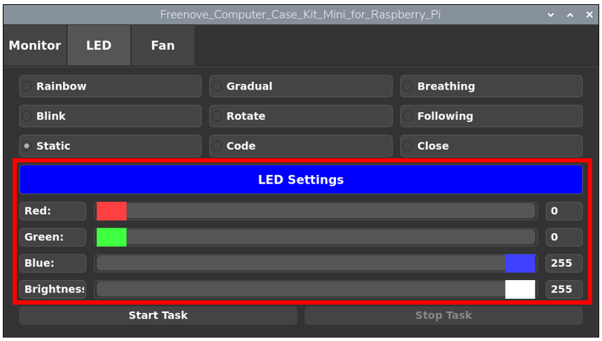

After selecting your preferred lighting effect, click the **“Start Task”** button. Both fans will then run with the chosen effect. To stop the lighting effect, click the **“Stop Task”** button.

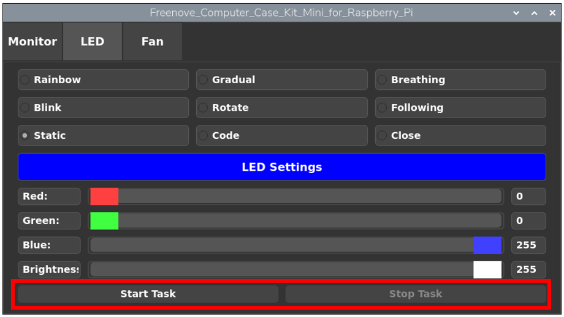

It is set to rainbow mode by default, as shown below.

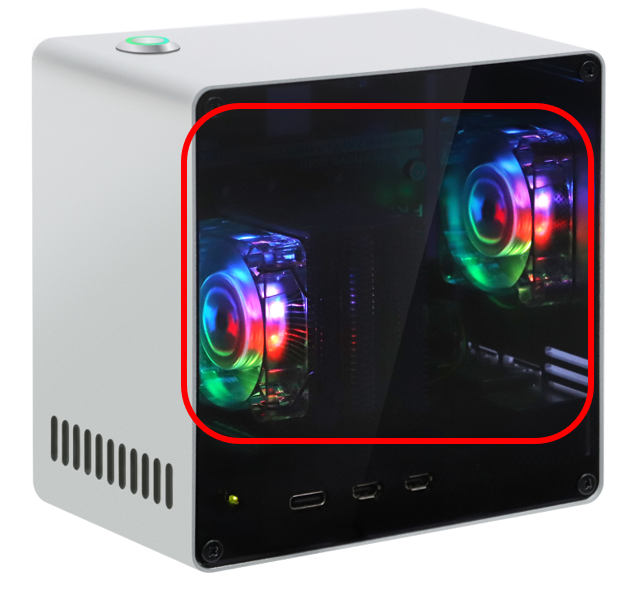

If the preset mode does not meet your need, you can modify the **led_run_code_mode** function in the **task_led.py** file under the “Freenove_Computer_Case_Kit_Mini_for_Raspberry_Pi/Code” directory.

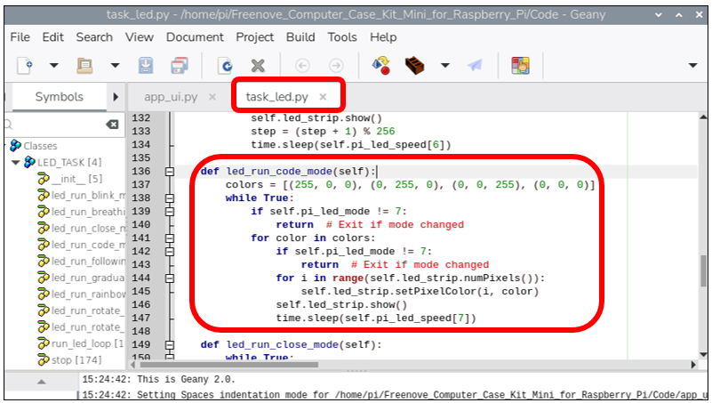

Restart the software, select **"Code"** mode, and then click **"Start Task"** to save it as default mode.

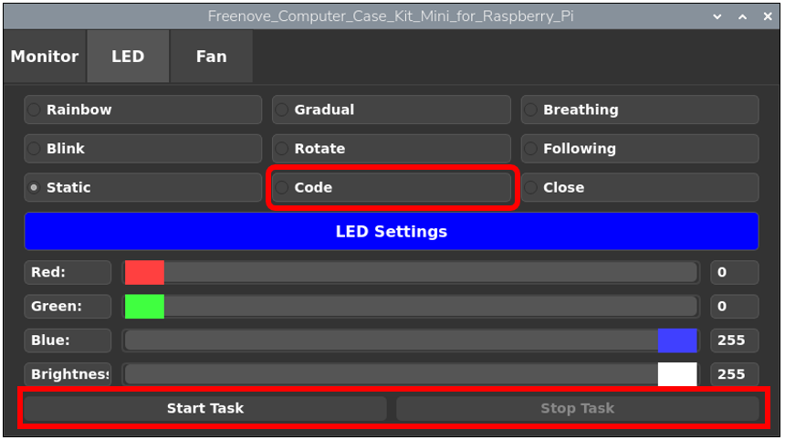

**Important Notes:**

1. Back up the source code before making any modifications.

2. Code mode is an advanced feature. Modifying the code in task_led.py requires a basic understanding of Python programming. If you are not familiar with programming, we do not recommend editing this file.

3. If, after modifying the code, you encounter either of the following issues: the software fails to start normally after a reboot, or the LED does not respond at all when clicking "Save Parameters," it indicates that an error in your code is preventing the program from running correctly. Please carefully review and correct the code.

3.2.3 Fan Control Interface
====================================

This is the case fan control interface for convenient fan management. The interface will change when you select different modes: Temp mode, Manual mode, or Default mode.

.. table::
    :class: table-line
    :align: center
    
    +----------------+
    | Temp Mode      |
    |                |
    | |Chapter03_15| |
    +----------------+
    | Manual mode    |
    |                |
    | |Chapter03_16| |
    +----------------+
    | Default mode   |
    |                |
    | |Chapter03_17| |
    +----------------+

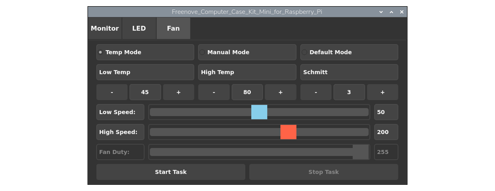
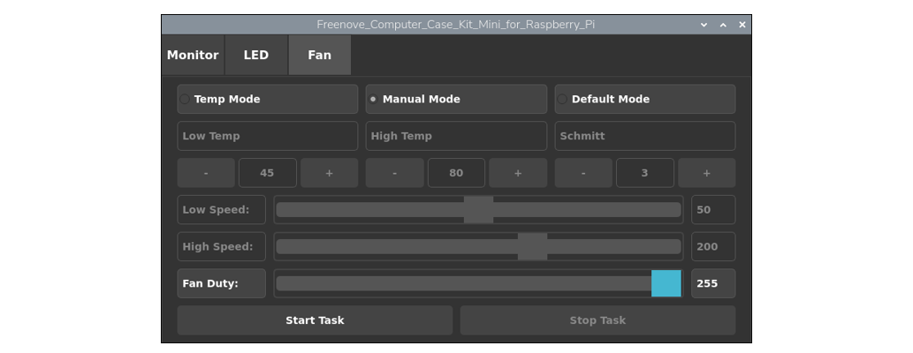
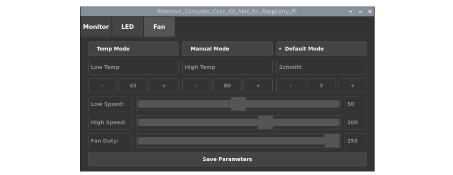

Next, we will walk you through the different fan modes to help you better understand the case fan control interface.

Temp mode
------------------------

In Temp mode, the CPU temperature of the Raspberry Pi is sampled at regular intervals. The control logic for this process is shown in the following figure.

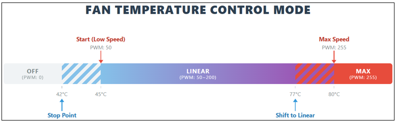

The diagram uses various colors to represent different temperature zones. All values shown are configurable defaults.

* Heating Phase:

  - When temperature ≥ **Low Temp** (default: 45°C), the fans start at **Low Speed** (default: 50).

  - When the temperature is within the set range (default: 45°C to 80°C), the fan's PWM value varies linearly within the configured range (default: 50 to 200). The higher the temperature, the faster the fan speed.

  - When temperature ≥ **High Temp** (default: 80°C), the fan speed increases to **full speed** (255).

* Cooling Phase:

  - When the temperature < **High Temp - Schmitt** (default: 80 - 3 = 77°C), the fan's PWM value varies linearly within the configured range (default: 50 to 200), ensuring a smooth and stable cooling process.

  - When temperature < **Low Temp- Schmitt** (default: 45 - 3 = 42°C), the fan stops.

You can configure the following parameters via the software. After configuration, click the **"Start Task"** button to apply the settings. To turn off the fans, click the **“Stop Task”** button.

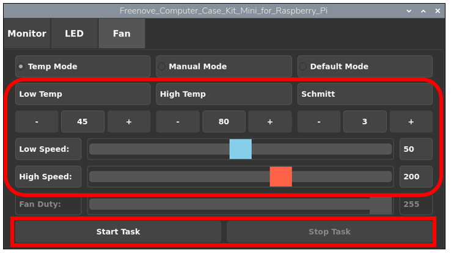

* **Low Temp**: The minimum temperature threshold to activate the case fans. Once reached, the fans begin spinning to accelerate airflow and expel warm air from the case.

* **High Temp**: A higher temperature threshold indicating significant heat buildup. When reached, the fans operate at a higher speed to enable rapid cooling of the system.

* **Schmitt (Hysteresis)**: A hysteresis value that prevents the fans from frequently switching on/off or changing speeds near a temperature threshold. It is recommended to keep it at the default value.

* **Low Speed**: The PWM duty cycle applied when the temperature first exceeds the Low Temp threshold. This low speed provides a quiet and power-efficient means of initial cooling.

* **High Speed**: The high PWM duty cycle activated when the temperature exceeds the High Temp threshold. This is critical during heavy computational loads to maximize cooling efficiency, expel heat rapidly, and maintain optimal Raspberry Pi performance.

Manual mode
------------------------

In this mode, you can manually adjust the fan's PWM value (range: 0-255) using the slider of "**Fan Duty**". After setting the desired value, click the **"Start Task"** button to apply the change. To turn off the fans, click the **“Stop Task”** button.

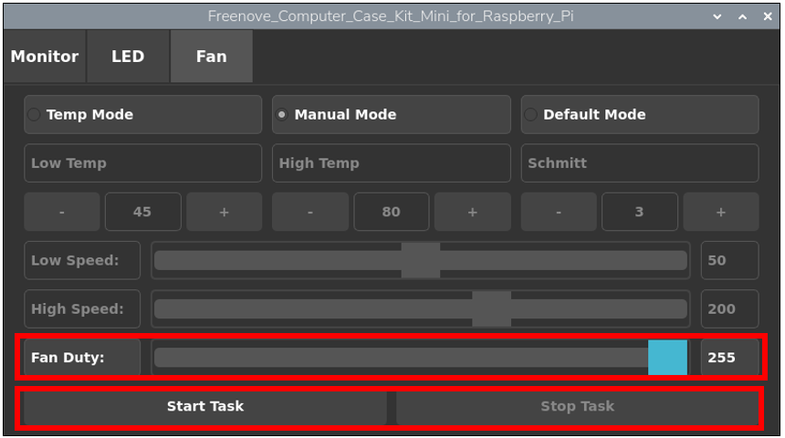

Defualt mode
------------------------

Select **“Default Mode”** and click **“Start Task”** to apply the configuration. The fan will operate according to the default thermal management policy of the Raspberry Pi 5. To turn off the fans, click the **“Stop Task”** button.

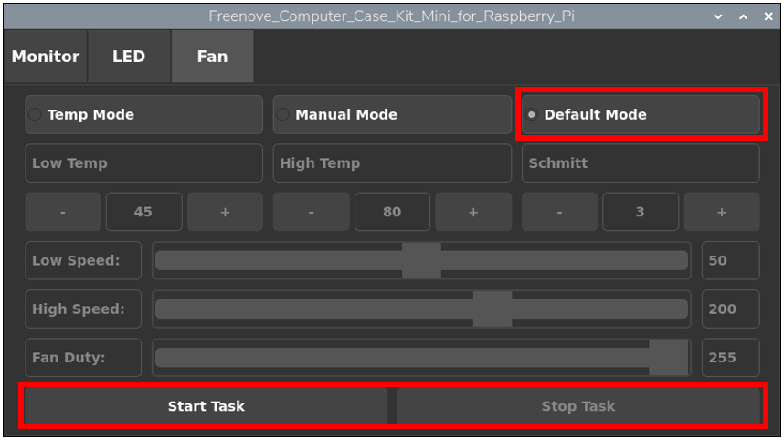

As the temperature of the Raspberry Pi 5 increases, the fan reacts in the following way:

* below 50°C, the fan does not spin at all (0% speed).

* at 50°C, the fan turns on at a low speed (30% speed)

* at 60°C, the fan speed increases to a medium speed (50% speed)

* at 67.5°C, the fan speed increases to a high speed (70% speed)

* at 75°C the fan increases to full speed (100% speed)

Temperature decreases use the same mapping with a 5°C hysteresis; fan speed decreases when the temperature drops to 5°C below each of the above thresholds.

To learn more about the Raspberry Pi 5's default thermal management policy, please refer to the link below:

https://www.raspberrypi.com/documentation/computers/raspberry-pi.html#fan-cases

3.2.4 Enable Terminal Display(For Debugging)
========================================================================

To enable custom programming, please follow the steps below to activate the command terminal display. This will allow you to view debug information and other code output.

Steps:

Open the terminal on your Raspberry Pi.

Run the following command to set the correct permissions for the Freenove desktop software:

.. code-block:: console
    
    ls -al ~/Desktop/Freenove.desktop
    sudo chmod 777 ~/Desktop/Freenove.desktop

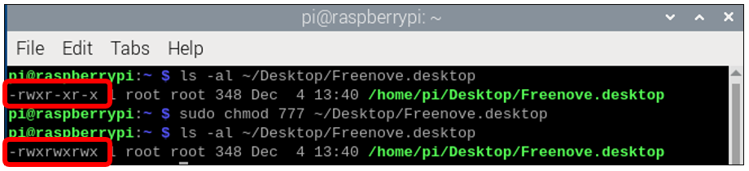

To revert to the default permissions, run the following command:

.. code-block:: console
    
    ls -al ~/Desktop/Freenove.desktop
    sudo chmod 755 ~/Desktop/Freenove.desktop

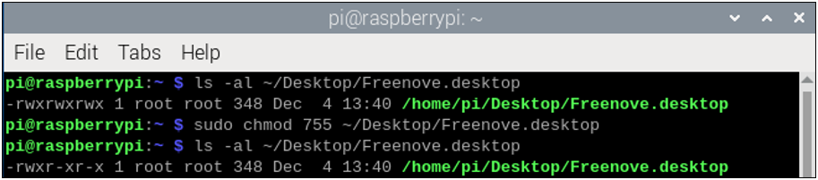

After modifying the permissions for Freenove.desktop, please follow these steps:

1.	Close the current upper-computer software completely.

2.	Double-click the Freenove software on the desktop to restart the application.

3.	In the pop-up window, click Open to launch the software.

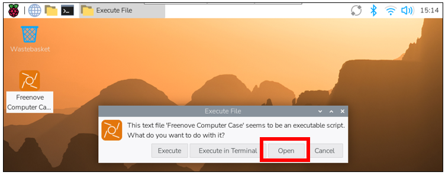

Change the parameter of **Terminal** from false to **ture**, save and clost the file. 

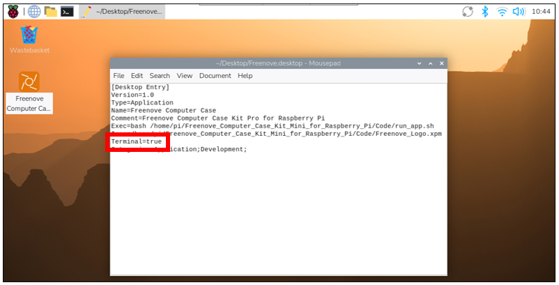

Double click Freenove software on the desktop, click **“Execute”** upon the pop-up window to launch it

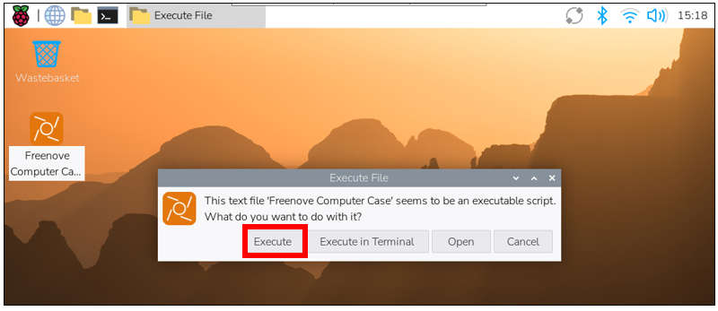

When you open the Freenove software control interface, a command terminal will automatically launch alongside it. All debug information and program logs will be displayed in this terminal window.

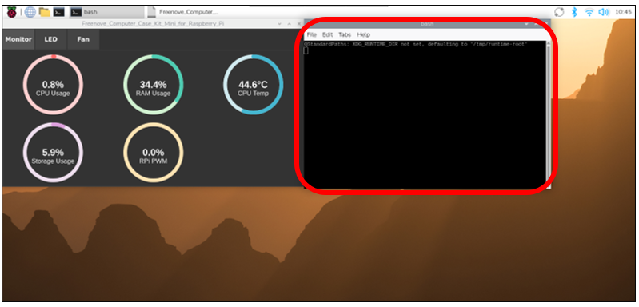