##############################################################################
List
##############################################################################

Before getting started, please check the part list. If any component is missing from your kit, do not start assembly; instead, please email support@freenove.com to get the missing parts.

Metal Parts
****************************

.. table::
    :class: table-line
    :align: center
    
    +-------------------+
    | Metal case x1     |
    |                   |
    | |List00|          |
    +-------------------+
    | Tower Cooler x1   |
    |                   |
    | Thermal Pad x5    |
    |                   |
    | Nylon Standoff x2 |
    |                   |
    | |List01|          |
    +-------------------+

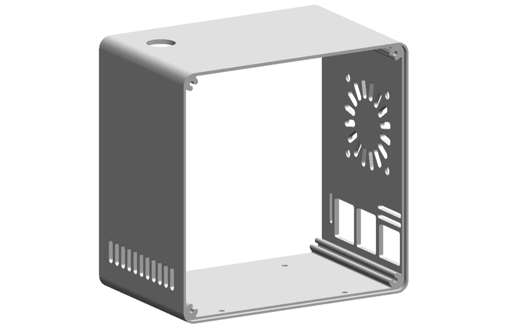
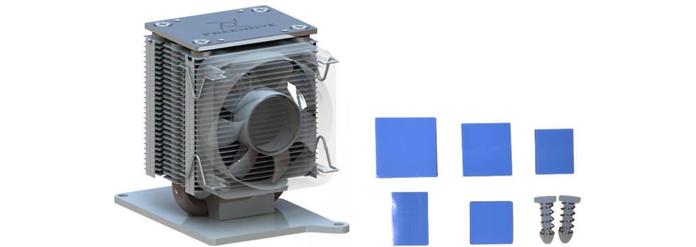

Acrylic Parts
****************************

:red:`Note: Please tear off the protective films from the acrylic parts before use.`

.. table::
    :class: table-line
    :align: center
    
    +---------------------------+
    | Acrylic Side Plate Set x1 |
    |                           |
    | |List02|                  |
    +---------------------------+

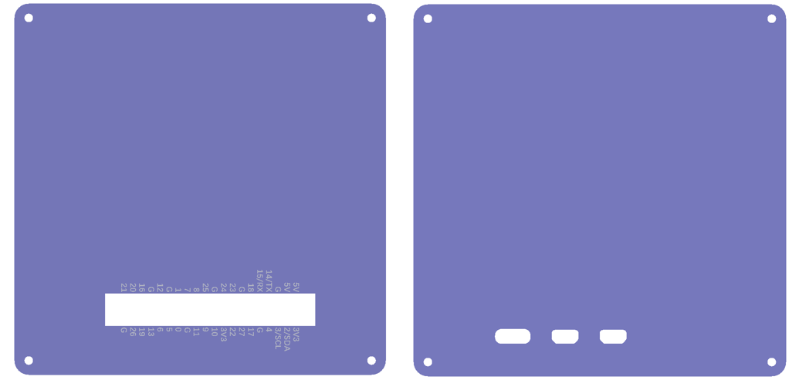

Machinery Parts
*****************************

All fasteners come in a larger bag, please open it and check whether they are complete.

.. table::
    :class: table-line
    :align: center
    
    +----------+----------+----------+
    | |List03| | |List04| | |List05| |
    +----------+----------+----------+
    | |List06| | |List07| |          |
    +----------+----------+----------+

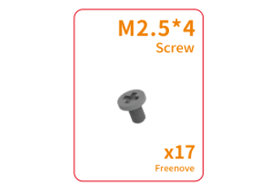
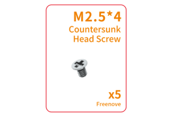
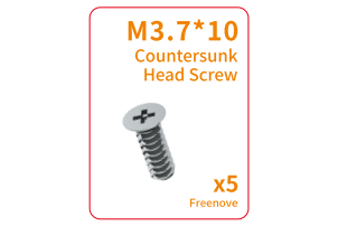
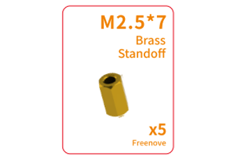
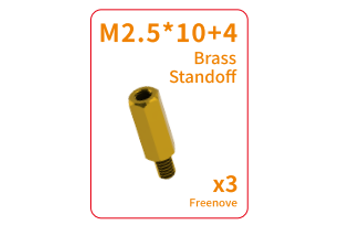

Electronic Parts
************************

Freenove Case GPIO Adapter for Raspberry Pi
===================================================

.. table::
    :class: table-line
    :align: center
    
    +----------+----------+
    | |List08| | |List09| |
    +----------+----------+

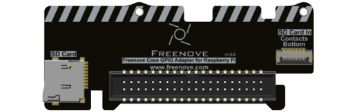
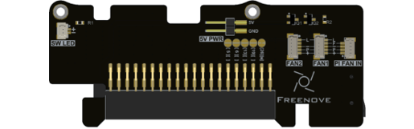

Freenove Power Button Board for Raspberry Pi
====================================================

.. table::
    :class: table-line
    :align: center
    
    +----------+----------+
    | |List10| | |List11| |
    +----------+----------+

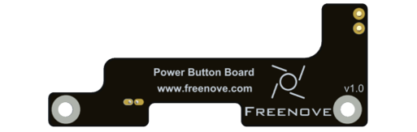
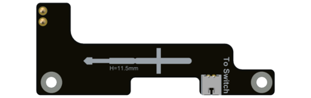

Freenove M.2 NVMe Adapter Series for Raspberry Pi
**********************************************************

:red:`Note: The components included in the NVMe Adapter Combo Pack vary by product version. Please verify that the contents match your model before installation.`

.. table::
    :class: table-line
    :align: center
    
    +--------------------------------------------------------------------------------------------+
    | Freenove M.2 Nvme Adapter for Raspberry Pi Combo Pack x1 (:red:`Only for FNK0108A/H`)      |
    |                                                                                            |
    | |List12|                                                                                   |
    +--------------------------------------------------------------------------------------------+
    | Freenove Dual M.2 Nvme Adapter for Raspberry Pi Combo Pack x1 (:red:`Only for FNK0108B/K`) |
    |                                                                                            |
    | |List13|                                                                                   |
    +--------------------------------------------------------------------------------------------+
    | Freenove Quad M.2 Nvme Adapter for Raspberry Pi Combo Pack x1 (:red:`Only for FNK0108C/L`) |
    |                                                                                            |
    | |List14|                                                                                   |
    +--------------------------------------------------------------------------------------------+

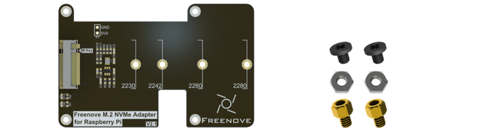
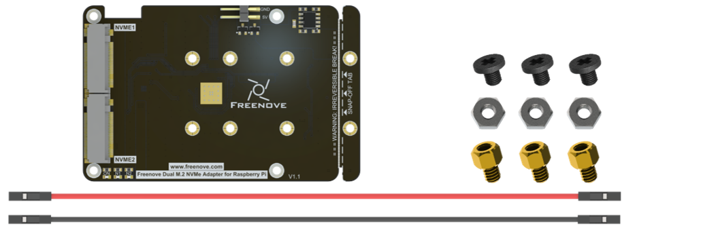
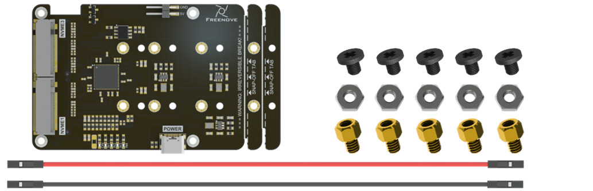

Electronic Modules
===============================

.. table::
    :class: table-line
    :align: center
    
    +-------------+----------------------------------------+
    | ARGB Fan x1 | NVMe SSD x1 (:red:`Only FNK0108H/K/L`) |
    |             |                                        |
    | |List15|    | |List16|                               |
    +-------------+----------------------------------------+

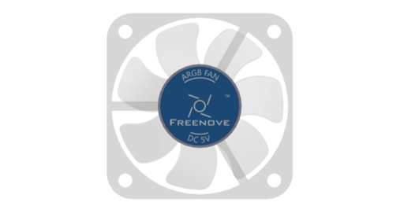
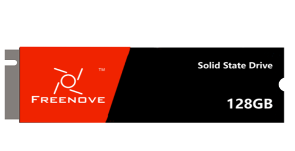

Wires
******************

.. table::
    :class: table-line
    :align: center
    
    +-----------------------------------------+-----------------------------------------+
    | SH1.0mm_4P Same-Direction Cable 12cm x1                                           |
    |                                                                                   |
    | |List17|                                                                          |
    +-----------------------------------------+-----------------------------------------+
    | SH1.0mm 2-Pin to 2.8mm Quick-Disconnect Terminal Cable (Red-Black), 7cm, x1       |
    |                                                                                   |
    | 1.25mm 2-Pin to 2.8mm Quick-Disconnect Terminal Cable (Yellow-Yellow), 7cm, x1    |
    |                                                                                   |
    | |List18|                                                                          |
    +-----------------------------------------+-----------------------------------------+
    | SD Card to 0.5mm-16P FPC cable x1       | PCIe FPC cable x1                       |
    |                                         |                                         |
    | |List19|                                | |List20|                                |
    +-----------------------------------------+-----------------------------------------+

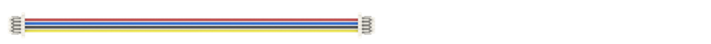

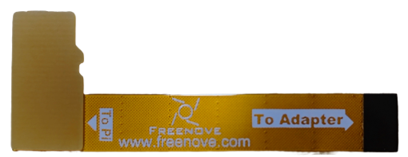
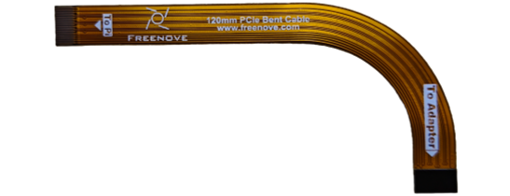

Tools
********************

.. table::
    :class: table-line
    :align: center
    
    +------------------------------+
    | Screwdriver Bit Holder x1    |
    |                              |
    | Hex Shank Phillips #2 Bit x1 |
    |                              |
    | Hex Shank Phillips #0 Bit x1 |
    |                              |
    | |List21|                     |
    +------------------------------+

Others
************************

.. table::
    :class: table-line
    :align: center
    
    +--------------------------+----------------------------------+
    | 12mm LED Power Button x1 | Air Inlet Dust Filter x1         |
    |                          |                                  |
    | Black Sealing Gasket x1  | |List23|                         |
    |                          |                                  |
    | M12 Nut x1               |                                  |
    |                          |                                  |
    | |List22|                 |                                  |
    +--------------------------+----------------------------------+
    | Fan Dust Filter x1       | Round Black Non-Slip Foot Pad x5 |
    |                          |                                  |
    | |List24|                 | |List25|                         |
    +--------------------------+----------------------------------+

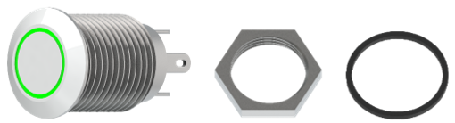
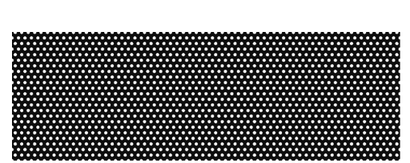
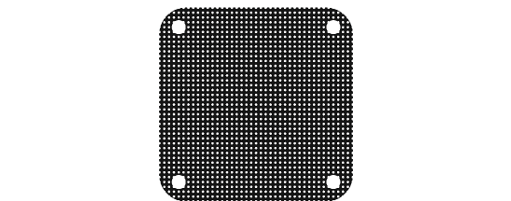

Rquired but NOT Contained Parts
*********************************

.. table::
    :class: table-line
    :align: center
    
    +-------------------------------------------------------------------------------------------------------------------+
    | Raspberry Pi 5 x1                                                                                                 |
    |                                                                                                                   |
    | |List26|                                                                                                          |
    +-------------------------------------------------------------------------------------------------------------------+
    | 27W Power Adapter x1(:red:`or a power adapter compatible with Raspberry Pi official one that can output 5.1V/5A`) |
    |                                                                                                                   |
    | |List27|                                                                                                          |
    +-------------------------------------------------------------------------------------------------------------------+
    | Micro SD Card (TF Card), Card Reader x1                                                                           |
    |                                                                                                                   |
    | |List28|                                                                                                          |
    +-------------------------------------------------------------------------------------------------------------------+

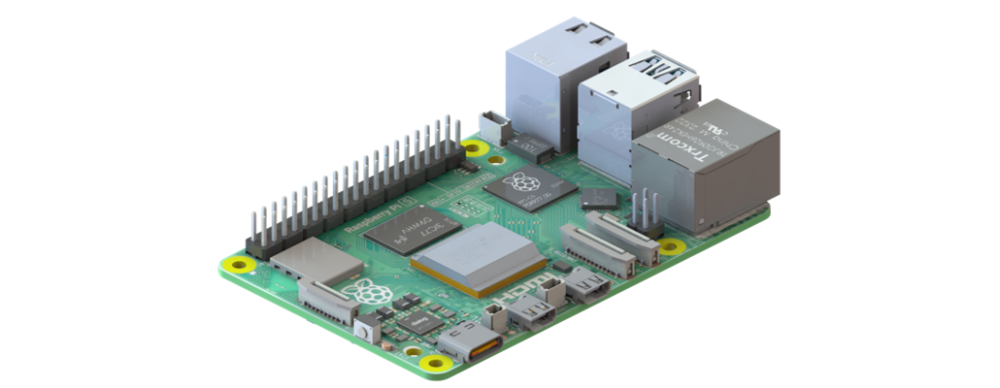

Before getting started, please check the part list. If any component is missing from your kit, do not start assembly; instead, please email our support team at support@freenove.com to get the missing parts.