##############################################################################
List
##############################################################################

Before getting started, please check the part list. If any component is missing from your kit, do not start assembly; instead, please email support@freenove.com to get the missing parts.

Metal Parts
****************************

.. table::
    :class: table-line
    :align: center
    
    +-------------------+
    | Metal case x1     |
    |                   |
    | |List29|          |
    +-------------------+
    | Tower Cooler x1   |
    |                   |
    | Thermal Pad x5    |
    |                   |
    | Nylon Standoff x2 |
    |                   |
    | |List30|          |
    +-------------------+

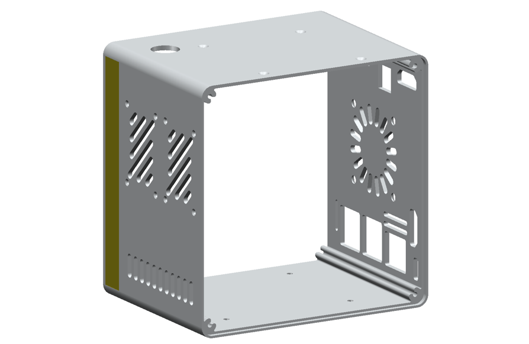
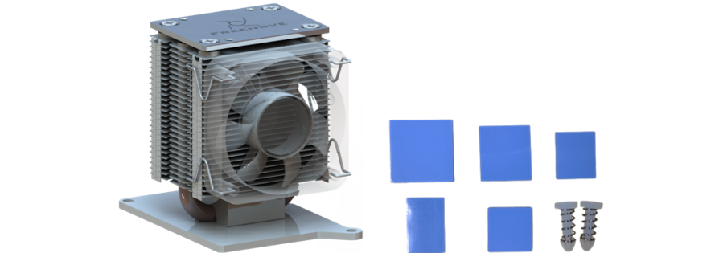

Acrylic Parts
****************************

:red:`Note: Please tear off the protective films from the acrylic parts before use.`

.. table::
    :class: table-line
    :align: center
    
    +---------------------------+
    | Acrylic Side Plate Set x1 |
    |                           |
    | |List31|                  |
    +---------------------------+
    | Speaker Acrylic Pad x2    |
    |                           |
    | |List32|                  |
    +---------------------------+

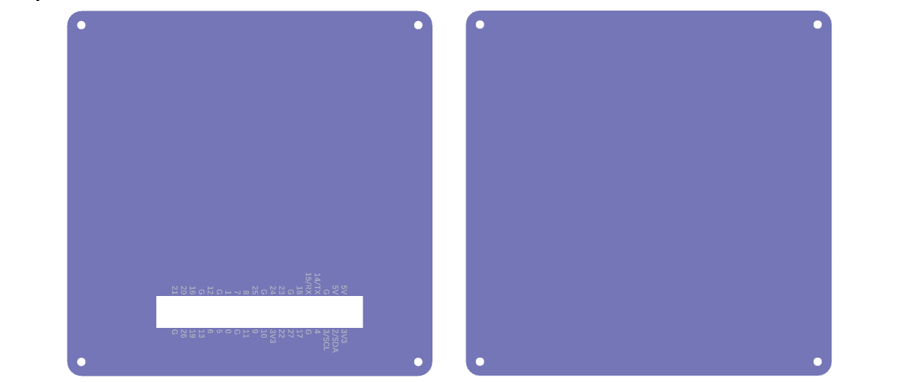

Machinery Parts
******************************

All fasteners come in a larger bag, please open it and check whether they are complete.

.. table::
    :class: table-line
    :align: center
    
    +----------+----------+----------+
    | |List33| | |List34| | |List35| |
    +----------+----------+----------+
    | |List36| | |List37| | |List38| |
    +----------+----------+----------+

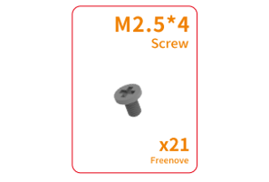
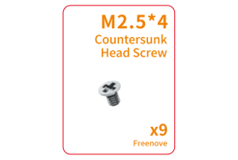
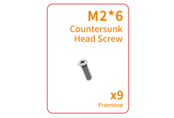
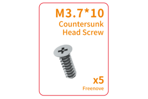
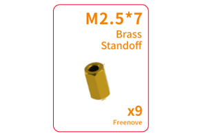
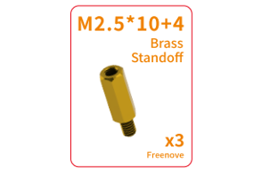

Electronic Parts
*******************************

Freenove Case GPIO Adapter for Raspberry Pi
====================================================

.. table::
    :class: table-line
    :align: center
    
    +----------+----------+
    | |List39| | |List40| |
    +----------+----------+

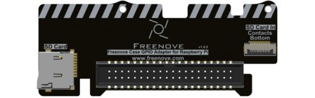
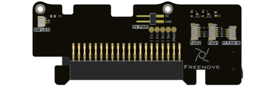

Freenove Power Button Board for Raspberry Pi
====================================================

.. table::
    :class: table-line
    :align: center
    
    +----------+----------+
    | |List41| | |List42| |
    +----------+----------+

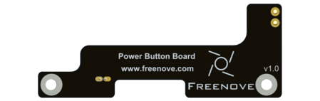
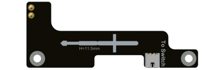

Freenove M.2 NVMe Adapter Series for Raspberry Pi
====================================================

:red:`Note: The components included in the NVMe Adapter Combo Pack vary by product version. Please verify that the contents match your model before installation.`

.. table::
    :class: table-line
    :align: center
    
    +--------------------------------------------------------------------------------------------+
    | Freenove M.2 Nvme Adapter for Raspberry Pi Combo Pack x1 (:red:`Only for FNK0108P/U`)      |
    |                                                                                            |
    | |List43|                                                                                   |
    +--------------------------------------------------------------------------------------------+
    | Freenove Dual M.2 Nvme Adapter for Raspberry Pi Combo Pack x1 (:red:`Only for FNK0108Q/V`) |
    |                                                                                            |
    | |List44|                                                                                   |
    +--------------------------------------------------------------------------------------------+
    | Freenove Quad M.2 Nvme Adapter for Raspberry Pi Combo Pack x1 (:red:`Only for FNK0108R/W`) |
    |                                                                                            |
    | |List45|                                                                                   |
    +--------------------------------------------------------------------------------------------+

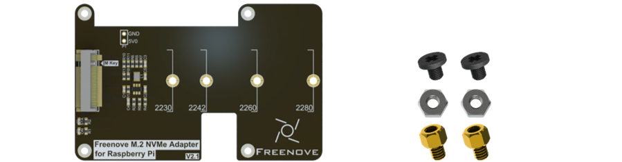
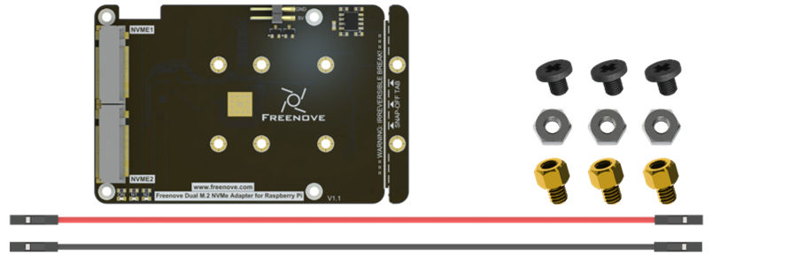
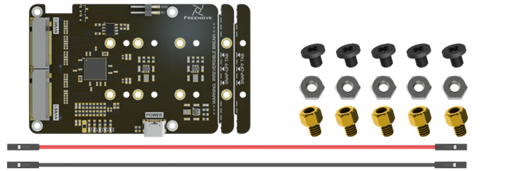

Freenove Case Power Board for Raspberry Pi
====================================================

.. table::
    :class: table-line
    :align: center
    
    +----------+----------+
    | |List46| | |List47| |
    +----------+----------+

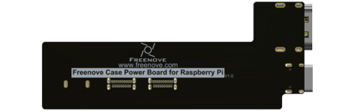
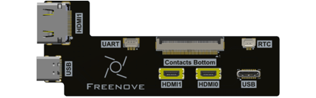

Freenove Case Adapter for Raspberry Pi
====================================================

.. table::
    :class: table-line
    :align: center
    
    +----------+----------+
    | |List48| | |List49| |
    +----------+----------+

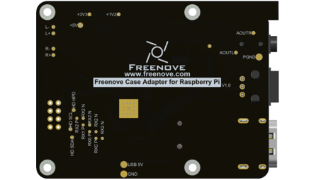
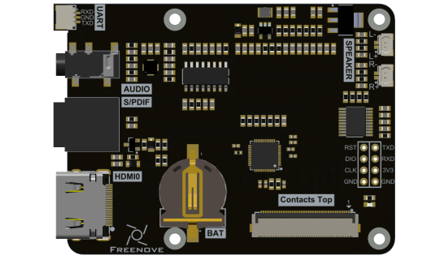

Electronic Modules
===========================

.. table::
    :class: table-line
    :align: center
    
    +-------------+------------+---------------------------------+
    | ARGB Fan x1 | Speaker x2 | NVMe SSD x1 (Only FNK0108U/V/W) |
    |             |            |                                 |
    | |List50|    | |List51|   | |List52|                        |
    +-------------+------------+---------------------------------+

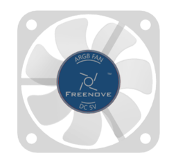
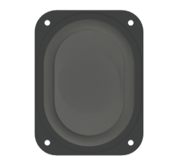
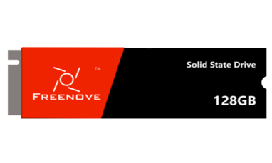

Wires
*********************

.. table::
    :class: table-line
    :align: center
    
    +--------------------------------------------------------------------------------+----------------------+
    | SH1.0mm_2P Same-Direction Cable 5cm x1                                                                |
    |                                                                                                       |
    | SH1.0mm_3P Same-Direction Cable 5cm x1                                                                |
    |                                                                                                       |
    | SH1.0mm_4P Same-Direction Cable 12cm x1                                                               |
    |                                                                                                       |
    | |List53|                                                                                              |
    +--------------------------------------------------------------------------------+----------------------+
    | SH1.0mm 2-Pin to 2.8mm Quick-Disconnect Terminal Cable (Red-Black), 7cm, x1    |                      |
    |                                                                                |                      |
    | 1.25mm 2-Pin to 2.8mm Quick-Disconnect Terminal Cable (Yellow-Yellow), 7cm, x1 |                      |
    |                                                                                |                      |
    | |List54|                                                                       |                      |
    +--------------------------------------------------------------------------------+----------------------+
    | 86mm HDMI FPC Cable x1                                                                                |
    |                                                                                                       |
    | |List55|                                                                                              |
    +--------------------------------------------------------------------------------+----------------------+
    | SD Card to 0.5mm-16P FPC cable x1                                              | PCIe FPC cable x1    |
    |                                                                                |                      |
    | |List56|                                                                       | |List57|             |
    +--------------------------------------------------------------------------------+----------------------+

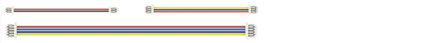

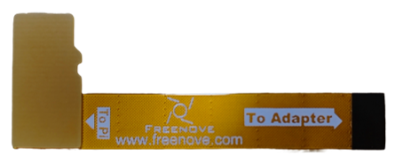
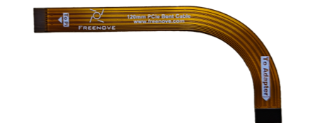

Tools
*********************

.. table::
    :class: table-line
    :align: center
    
    +------------------------------+
    | Screwdriver Bit Holder x1    |
    |                              |
    | Hex Shank Phillips #2 Bit x1 |
    |                              |
    | Hex Shank Phillips #0 Bit x1 |
    |                              |
    | |List58|                     |
    +------------------------------+

Others
*********************

.. table::
    :class: table-line
    :align: center
    
    +--------------------------+----------------------------------+
    | 12mm LED Power Button x1 | Air Inlet Dust Filter x1         |
    |                          |                                  |
    | Black Sealing Gasket x1  | |List60|                         |
    |                          |                                  |
    | M12 Nut x1               |                                  |
    |                          |                                  |
    | |List59|                 |                                  |
    +--------------------------+----------------------------------+
    | Fan Dust Filter x1       | Round Black Non-Slip Foot Pad x5 |
    |                          |                                  |
    | |List61|                 | |List62|                         |
    +--------------------------+----------------------------------+

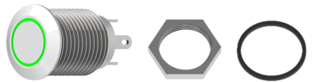
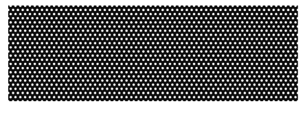
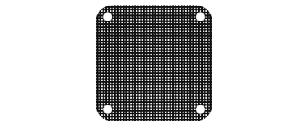

Rquired but NOT Contained Parts
*********************************************

.. table::
    :class: table-line
    :align: center
    
    +-------------------------------------------------------------------------------------------------------------+
    | Raspberry Pi 5 x 1                                                                                          |
    |                                                                                                             |
    | |List63|                                                                                                    |
    +-------------------------------------------------------------------------------------------------------------+
    | 27W Power Adapter x 1(or a power adapter compatible with Raspberry Pi official one that can output 5.1V/5A) |
    |                                                                                                             |
    | |List64|                                                                                                    |
    +-------------------------------------------------------------------------------------------------------------+
    | Micro SD Card (TF Card), Card Reader x 1                                                                    |
    |                                                                                                             |
    | |List65|                                                                                                    |
    +-------------------------------------------------------------------------------------------------------------+

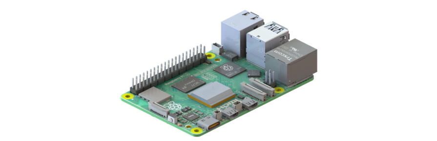

Before getting started, please check the part list. If any component is missing from your kit, do not start assembly; instead, please email our support team at support@freenove.com to get the missing parts.