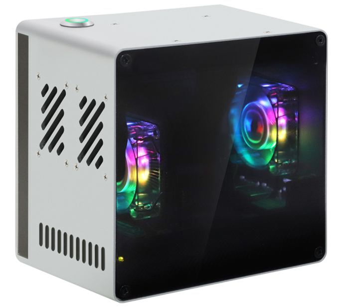

##############################################################################
Preface
##############################################################################

**Welcome to use the Freenove Computer Case Kit Mini for Raspberry Pi**

This product is exclusively designed for the RPi 5, a popular single-board computer (SBC). Follow this tutorial, you can install a sleek, multi-functional computer case kit for your Raspberry Pi 5 (RPi 5).

The RPi 5 delivers highly powerful performance with a CPU frequency of up to 2.4GHz. However, this increased power consumption also leads to significant heat generation. Without an appropriate heatsink, thermal throttling may severely limit the Raspberry Pi 5's performance. Additionally, the removal of the 3.5mm audio jack in the RPi 5 has caused inconvenience for many users.

In this context, our case kit came into being. It not only addresses these issues, but also introduces advanced features.

If you encounter any issues, feel free to contact us for prompt and free technical support.

support@freenove.com

Key Features
****************************

This product integrates a wide range of features and supports multiple optional expansions, as detailed below:

* **Standard Features**:
  
  - Built-in dual 4Ω 3W speakers for audio output.
  
  - Equipped with a 3.5mm JACK audio interface.
  
  - Applying a tower cooler for more efficient heat dissipation.
  
  - Built-in two ARGB 4010 cooling fans for lower overall case temperature and enhanced lighting effects
  
  - Classic case design.
  
  - Power button with indicator light.
  
  - Featuring a 1220 RTC battery holder.
  
  - Ports are uniformly arranged on the back of the case, including USB, Ethernet, UART, HDMI, 3.5mm JACK, SD card slot, and power interface for easy connection and management

* **Optional Features**:
  
  - Supports MVMe M.2 slot expansion in 2230/2242/2260/2280 specifications; optional configurations of 1/2/4 slots to meet different storage needs
  
  - Optional 128GB SSD for basic storage requirements

Product Variants
****************************

This product is currently offered in multiple variants. with the primary distinction being **the number of NVMe slots**. Models FNK0108H/K/L are additionally equipped with one NVMe M.2 SSD

.. table::
    :class: zebra
    :align: center
    
    +----------+---------------------+-----------------+
    | Models   | Number of NVMe Slot | NVMe M.2 SSD x1 |
    +==========+=====================+=================+
    | FNK0108P | 1                   | ✖               |
    +----------+---------------------+-----------------+
    | FNK0108Q | 2                   | ✖               |
    +----------+---------------------+-----------------+
    | FNK0108R | 4                   | ✖               |
    +----------+---------------------+-----------------+
    | FNK0108U | 1                   | ✔               |
    +----------+---------------------+-----------------+
    | FNK0108V | 2                   | ✔               |
    +----------+---------------------+-----------------+
    | FNK0108W | 4                   | ✔               |
    +----------+---------------------+-----------------+
